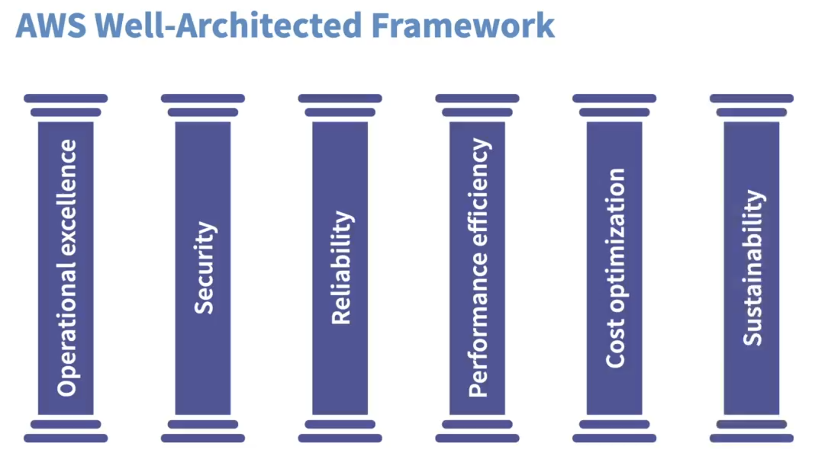
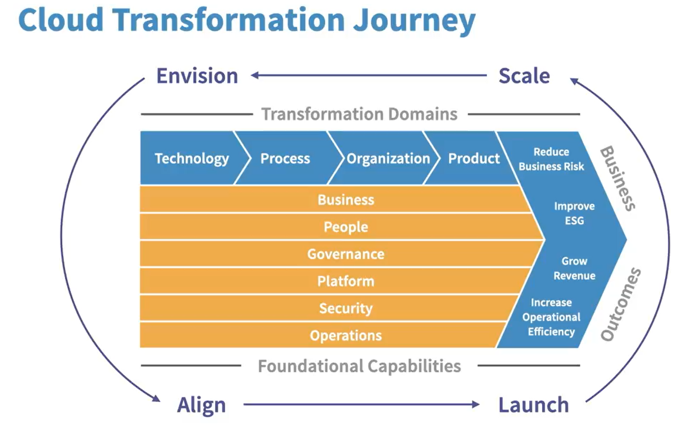

# Domain 1: Cloud Concepts
- 24% of the AWS CLF-C02 exam
- Define the value proposition of AWS Cloud
- Identify design principles of AWS Cloud
- Understand benefits and strategies for migrating existing IT infrastructure to AWS Cloud
- Understand concepts of cloud economics

# Introduction to Cloud Computing

## What is cloud?
- It is actually the Internet !
- global network of connected devices

## The Internet
- Worldwide Network
- Many devices
- Communication
- created and connected using cables

  

## What is Cloud Computing?
- **On-demand delivery of compute, database storage, application, and other IT resources**
- it lets you access your data anywhere as long as you have an internet connection
- Utilizes a pay-as-you-go model - paying only for what you use or when you use them (provides more flexibility with flexible billing for server usage)
- Most transactions utilize "buy first to use", such as computer or car

### Collaboration with Cloud Computing
- Hold virtual meetings
- Edit documents together
- Communicate with messaging services
- send emails

### Cloud Computing Features
- Instantaneous access
- access resources where and when you want
- More flexible and affordable than legacy IT infrastructure
- Affordable for organizations and individuals with smaller budgets

### Cloud Computing in daily lifes
- emails
- streaming services
- google drive

### Deployment models for cloud computing

When selecting a cloud strategy, a company must consider factors such as required cloud application components, preferred resource management tools, and any legacy IT infrastructure requirements.

The three cloud computing deployment models are **cloud-based**, **on-premises**, and **hybrid**.

1. Cloud-Based Deployment
- Run all parts of the application in the cloud.
- Migrate existing applications to the cloud.
- Design and build new applications in the cloud.

In a cloud-based deployment model, you can migrate existing applications to the cloud, or you can design and build new applications in the cloud. You can build those applications on low-level infrastructure that requires your IT staff to manage them. Alternatively, you can build them using higher-level services that reduce the management, architecting, and scaling requirements of the core infrastructure.

For example, a company might create an application consisting of virtual servers, databases, and networking components that are fully based in the cloud.

2. On-Premises Deployment

- Deploy resources by using virtualization and resource management tools.
- Increase resource utilization by using application management and virtualization technologies.

On-premises deployment is also known as a private cloud deployment. In this model, resources are deployed on premises by using virtualization and resource management tools.

For example, you might have applications that run on technology that is fully kept in your on-premises data center. Though this model is much like legacy IT infrastructure, its incorporation of application management and virtualization technologies helps to increase resource utilization.

3. Hybrid Deployment
- Connect cloud-based resources to on-premises infrastructure.
- Integrate cloud-based resources with legacy IT applications.

In a hybrid deployment, cloud-based resources are connected to on-premises infrastructure. You might want to use this approach in a number of situations. For example, you have legacy applications that are better maintained on premises, or government regulations require your business to keep certain records on premises.

For example, suppose that a company wants to use cloud services that can automate batch data processing and analytics. However, the company has several legacy applications that are more suitable on premises and will not be migrated to the cloud. With a hybrid deployment, the company would be able to keep the legacy applications on premises while benefiting from the data and analytics services that run in the cloud.

## Conclusion
Cloud = Internet
Made up of copper wires and global network of billions of devices
- Development of virtualization together with a piece of software called the **hypervisor** allowed us to think big, pulling together multiple servers and using all of their compute and storage resources together as if we're using one extremely large server
- It is actually like the cloud service providers hosting the mainframe for us, instead of connecting to the mainframe computer  and the data centre at the same floor, we use the internet to connect to the countless servers linked by hypervisors through big service providers like AWS, AZURE, GCP

# Cloud Computing Concepts

## Benefits of Cloud Computing
- you dont have to buy a computer with huge hard disk because you can save file on the cloud using services like Dropbox and these can be accessed by any machines on the internet
- no need for physical servers or cabling
- no need for server room setup and maintenance
- no hardware replacemnet or procurement
- pay on when and what you consume
- scale up or down instantaneously and only pay for what you use
- benefits from economy of scale

## Six Major advantages
1. Trade capital expense for variable expense
    - Pay only when you use computing resources, and only for how much you use.
2. Benefit from massive enocomies of scale
    - AWS aggregates usage from hundreds of thousands of customers in the cloud, which leads to higher economies of scale. This translates into lower pay-as-you-go prices.
3. Stop guessing capacity
    - When you make a capacity decision prior to deploying an application, you often end up either sitting on expensive idle resources or dealing with limited capacity. With cloud computing, you can access as much or as little capacity as you need, and scale up and down as required with only a few minutes notice.
4. Increase speed and agility
    - IT resources are only a click away, which means that you reduce the time to make resources available to your developers from weeks to minutes. This dramatically increases agility for the organization, because the cost and time it takes to experiment and develop is significantly lower.
5. Stop spending money running and maintaining data centers
    - Companies can focus on projects that differentiate their business instead of maintaining data centers. With cloud computing, you can focus on your customers, rather than on the heavy lifting of racking, stacking, and powering physical infrastructure.
6. Go global in minutes
    - Applications can be deployed in multiple Regions around the world with a few clicks. This means that you can provide lower latency and a better experience for your customers at a minimal cost.

## AWS Well-Architected Framework
- Allows Organizations to build the most secure, durable, efficient, and high-performing IT infrastructure possible

1. Avoid Unnecessary Cost (Cost Optimization)
    - Use only what you need
    - Reserve resources in advance
    - Continue to monitor for optimization

2. Reliability
    - Test disaster recovery settings
    - Incorporate redundancy
    - Have duplicate copies of resources

3. Efficiency (Performance)
    - The ability to use computing resources to adjust the system requirements
    - it should allow for more experimentation and when a change is set in motion, should be able to global in minutes

4. Security (Infrastructure)
    - Best practices should be automated
    - Data should always be protected
    - Enable traceability
    - Manage access

5. Operational Excellence
    - Document everything
    - Refine operational procedures
    - Anticipate failure
    - Update processes
    - Learn from Failures

If these five practices are taken into account and optimized, you will have a highly-performing, stable IT infrastructure that allow your organization to save money, time and resources

## AWS Cloud Adoption Framework (AWS CAF)
- Best practices to help successful IT infrastructure migration to the cloud
- Migrating to the cloud takes a lot of collaboration with different stakeholders
- Provides recommendations for implementing, adopting, configuring, and maintaining effective workflows in the cloud

### AWS CAF Cloud Transformation Value Chain
1. Technology Transformation
    - Utilize cloud to migrate and modernize legacy infrastructure, applications, and data and analytic platforms

2. Process Transformation
    - Digitize, automate, and optimize business operations

3. Organizational Transformation
    - Reimagine the operational model, or how your business and technology teams work together to create customer value and meet strategic goals

4. Product Transformation
    - Reimagine the business model by creating new value propositions and revenue models

### AWS CSF Key Business Outcome
- Reduced business risk
- Improved environmental, social, and governance (ESG) performance
- Revenue growth
- Increased operational efficiency

### Perspectives and Foundational Capabilities
1. Business perspective
    - Ensures that cloud investments accelerate digital transformation and business outcomes
2. People perspective
    - Create a culture of continuous growth and learning where change is embraced
3. Governace perspective
    - Maximize organizational benefits while minimizing cloud-transformation-related risks
4. Platform perspective
    - Build enterprise-grade, scalable, hybrid cloud platforms, implement cloud-native solutions, and modernize existing infrastructure
5. Security perspective
    - Achieve the confidentiality, integrity, and availability needs of cloud data and workloads
6. Operations perspective
    - Ensure that the cloud services delivered meet business needs

### Summary
In summary, each organization's journey into the cloud is different, and in order to have an effective cloud adoption experience, it is necessary to  first envision the desired target state, understanding the organization's cloud readiness, then adapt an agile and iterative approach to transformation incrementally, and learn from experience to achive the optimal target state.

Therefore, it is divided into four phases:
1. Envision Phase
    - Demonstrate how cloud adoption will help accelerate business outcomes and objectives
2. Align Phase
    - Identify capability gaps across the six CAF perspectives, identify cross-organizational dependencies, and recognize stakeholder concerns
3. Launch Phase
    - Deliver pilot initiatives in production and demonstrate incremental business value before scaling to full production
4. Scale Phase
    - Expand pilots, scaling up to meet desired business needs while sustaining business benefits

## Summary in a whole

### Six Advantages of Cloud Computing
1. Trade fixed expense for variable expense
2. Benefit from massive economies of scale
3. Stop guessing capacity
4. Increase speed and agility
5. Stop spending money running and maintaining data centers
6. Go global in minutes

### AWS Well-Architected Framework
1. Operational Excellence
2. Security
3. Reliability
4. Performance Efficiency
5. Cost Optimization
6. Sustainability

  

### AWS CAF (Cloud Adoption) framework

  

