# Security and Compliance
- 30% of the exam
- AWS shared responsibility model
- AWS Cloud security, governance, and compliance concepts
- AWS access management capabilities
- Identify components and resources for security

# Security in the Cloud

## IT Infrastructure: In the Past
- Server rooms secured with key cards
- Off-site data centers
- Lots of security devices and people
- Difficult to access

## IT Infrastructure: Present-Day AWS Cloud
- Global network of data centers built with security in mind
- Safeguards to protect customer privacy
- Dozens of compliance programs to help meet industry compliance requirements for data security
- High security standards without need for your own data centers
- Scale your business quickly

## Shared Responsibility Model (Your responsibility vs AWS responsibility)
- Security of cloud computing infrastructures and data is a **shared responsibility** between the customer and AWS
- AWS is responsibility of the security of the Cloud
- We or customers are responsibility with the security in the Cloud

The shared responsibility model divides into customer responsibilities (commonly referred to as “security in the cloud”) and AWS responsibilities (commonly referred to as “security of the cloud”).

  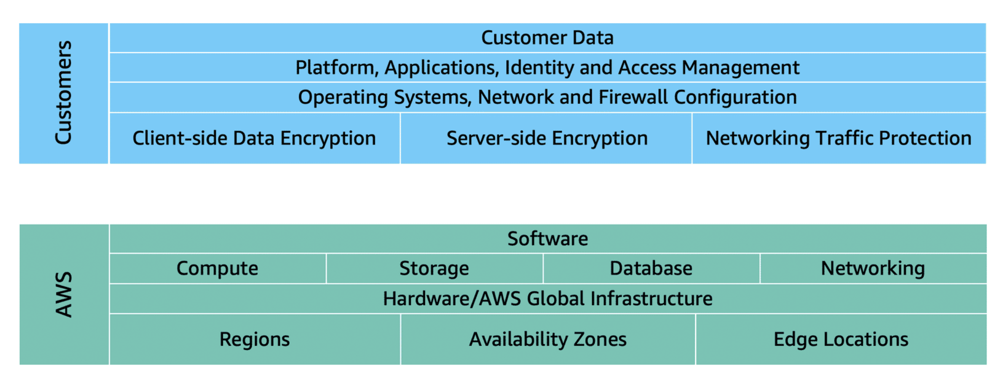

You can think of this model as being similar to the division of responsibilities between a homeowner and a homebuilder. The builder (AWS) is responsible for constructing your house and ensuring that it is solidly built. As the homeowner (the customer), it is your responsibility to secure everything in the house by ensuring that the doors are closed and locked. 

### Customers: Security in the cloud
Customers are responsible for the security of everything that they create and put in the AWS Cloud.

When using AWS services, you, the customer, maintain complete control over your content. You are responsible for managing security requirements for your content, including which content you choose to store on AWS, which AWS services you use, and who has access to that content. You also control how access rights are granted, managed, and revoked. 

The security steps that you take will depend on factors such as the services that you use, the complexity of your systems, and your company’s specific operational and security needs. Steps include selecting, configuring, and patching the operating systems that will run on Amazon EC2 instances, configuring security groups, and managing user accounts. 

### AWS: Security of the cloud
AWS is responsible for security of the cloud.

AWS operates, manages, and controls the components at all layers of infrastructure. This includes areas such as the host operating system, the virtualization layer, and even the physical security of the data centers from which services operate. 

AWS is responsible for protecting the global infrastructure that runs all of the services offered in the AWS Cloud. This infrastructure includes AWS Regions, Availability Zones, and edge locations.

AWS manages the security of the cloud, specifically the physical infrastructure that hosts your resources, which include:
- Physical security of data centers
- Hardware and software infrastructure
- Network infrastructure
- Virtualization infrastructure

Although you cannot visit AWS data centers to see this protection firsthand, AWS provides several reports from third-party auditors. These auditors have verified its compliance with a variety of computer security standards and regulations.

## Security in the Cloud
- Identity and access management (IAM)
- Detective controls
- Infrastructure protection
- Data protection
- Incident response

# Access Management

## Providing Access in AWS

### Security Groups vs. NACLs

| Security Groups | NACLs (Network Access Control Lists) |
|-----------------|-------|
| Protect at instance level | Protect at subnet level |
| Stateful: traffic allowed in is allowed out ("remembers") | Stateless: in and out traffic need to be defined separately ("forgets") |
| No explicit deny | Explicit deny (meaning that is more important than other rules) |
| All inbound traffic blocked and outbound traffic allowed by default | All inbound and outbound traffic allowed by default |

## Identity Acess management (IAM)
- Manage access to services and resources in the AWS Cloud
- Manage users and groups
- Can provide access to users or other AWS services
- Permissions are global; any access setting will be true all across regions
- Follow principle of least privilege

AWS Identity and Access Management (IAM) enables you to manage access to AWS services and resources securely.   

IAM gives you the flexibility to configure access based on your company’s specific operational and security needs. You do this by using a combination of IAM features

- IAM users, groups, and roles
- IAM policies
- Multi-factor authentication

## AWS account root user

When you first create an AWS account, you begin with an identity known as the root user. 

The root user is accessed by signing in with the email address and password that you used to create your AWS account. You can think of the root user as being similar to the owner of the coffee shop. It has complete access to all the AWS services and resources in the account.

  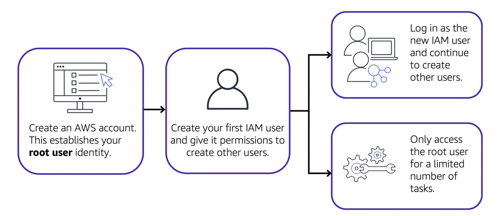

## IAM users

Example: IAM policy

Here’s an example of how IAM policies work. Suppose that the coffee shop owner has to create an IAM user for a newly hired cashier. The cashier needs access to the receipts kept in an Amazon S3 bucket with the ID: AWSDOC-EXAMPLE-BUCKET.

An IAM user is an identity that you create in AWS. It represents the person or application that interacts with AWS services and resources. It consists of a name and credentials.

By default, when you create a new IAM user in AWS, it has no permissions associated with it. To allow the IAM user to perform specific actions in AWS, such as launching an Amazon EC2 instance or creating an Amazon S3 bucket, you must grant the IAM user the necessary permissions.

Best practice:

We recommend that you create individual IAM users for each person who needs to access AWS.  

Even if you have multiple employees who require the same level of access, you should create individual IAM users for each of them. This provides additional security by allowing each IAM user to have a unique set of security credentials.

## IAM policies

An IAM policy is a document that allows or denies permissions to AWS services and resources.  

IAM policies enable you to customize users’ levels of access to resources. For example, you can allow users to access all of the Amazon S3 buckets within your AWS account, or only a specific bucket.

  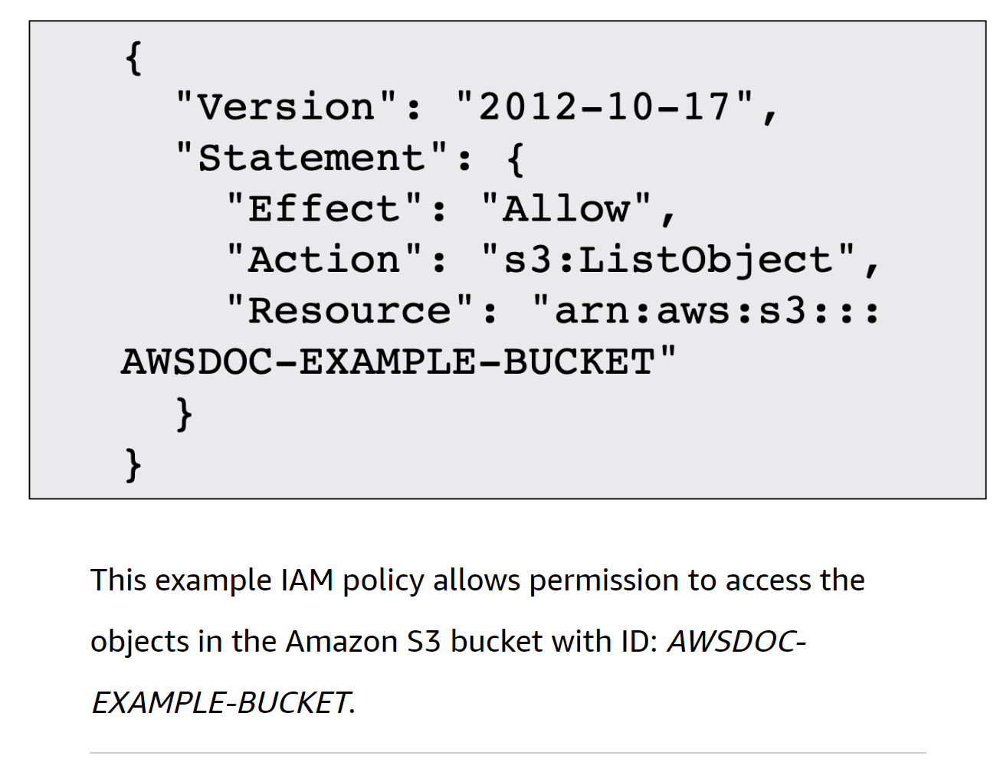

In this example, the IAM policy is allowing a specific action within Amazon S3: ListObject. The policy also mentions a specific bucket ID: AWSDOC-EXAMPLE-BUCKET. When the owner attaches this policy to the cashier’s IAM user, it will allow the cashier to view all of the objects in the AWSDOC-EXAMPLE-BUCKET bucket. 

If the owner wants the cashier to be able to access other services and perform other actions in AWS, the owner must attach additional policies to specify these services and actions.

Now, suppose that the coffee shop has hired a few more cashiers. Instead of assigning permissions to each individual IAM user, the owner places the users into an IAM group.

Best practice:

Follow the security principle of least privilege when granting permissions. 

By following this principle, you help to prevent users or roles from having more permissions than needed to perform their tasks. 

For example, if an employee needs access to only a specific bucket, specify the bucket in the IAM policy. Do this instead of granting the employee access to all of the buckets in your AWS account.

## IAM groups

An IAM group is a collection of IAM users. When you assign an IAM policy to a group, all users in the group are granted permissions specified by the policy.

Here’s an example of how this might work in the coffee shop. Instead of assigning permissions to cashiers one at a time, the owner can create a “Cashiers” IAM group. The owner can then add IAM users to the group and then attach permissions at the group level. 

  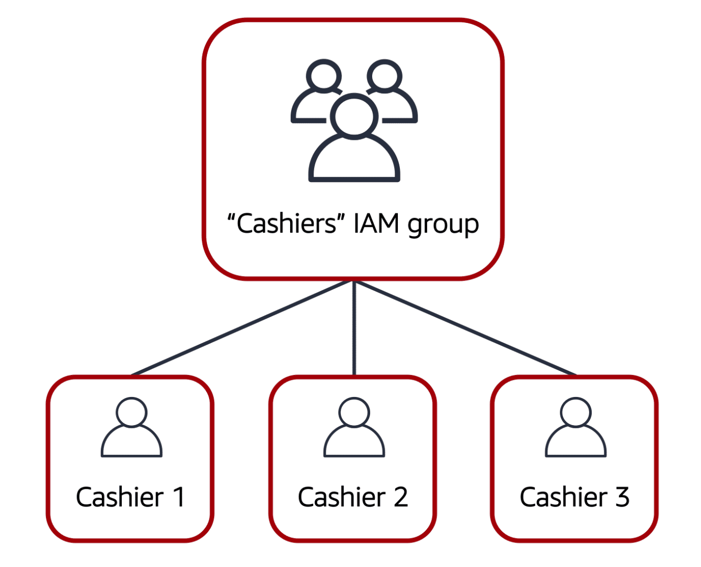

Assigning IAM policies at the group level also makes it easier to adjust permissions when an employee transfers to a different job. For example, if a cashier becomes an inventory specialist, the coffee shop owner removes them from the “Cashiers” IAM group and adds them into the “Inventory Specialists” IAM group. This ensures that employees have only the permissions that are required for their current role.

What if a coffee shop employee hasn’t switched jobs permanently, but instead, rotates to different workstations throughout the day? This employee can get the access they need through IAM roles.

## IAM roles

In the coffee shop, an employee rotates to different workstations throughout the day. Depending on the staffing of the coffee shop, this employee might perform several duties: work at the cash register, update the inventory system, process online orders, and so on. 

When the employee needs to switch to a different task, they give up their access to one workstation and gain access to the next workstation. The employee can easily switch between workstations, but at any given point in time, they can have access to only a single workstation. This same concept exists in AWS with IAM roles.

An IAM role is an identity that you can assume to gain temporary access to permissions.  

Before an IAM user, application, or service can assume an IAM role, they must be granted permissions to switch to the role. When someone assumes an IAM role, they abandon all previous permissions that they had under a previous role and assume the permissions of the new role. 

Best practice:

IAM roles are ideal for situations in which access to services or resources needs to be granted temporarily, instead of long-term.  

### Method 1 : Manage Users
- Create users in IAM and assign them security credentials
- Users can have very precise permission sets
- Users can access AWS through AWS management console
- You can provide programmatic access to data / resources
- Programmatic access: applications directly access resources instead of humans doing the same activity

### Method 2 : Manage IAM Roles
- Create roles to manage permissions and what those roles can do
- An entity assumes a role to obtain temporary security credentials to make API calls to your resources
- Used to provide a user from another AWS account with access to your AWS account

### Method 3 : Manage federated Users
- enable identity federation: allow existing identities in your enterprise to access AWS without having to create an IAM user for each identity

### Benefits of IAM
- Enhanced security
- granular Control
- Ability to provide temporary credentials
- Flexible Security credential management 
- Federated access
- Seamless integration across various AWS services

## Principle of Least Privilege
- Who can access what?
- Every role has a set of access permissions necessary to effectively completes its jobs, and the individual in the role should have no more and no less than the optimal level of access

## Keeping accounts secured

### Security Credentials
- Password Policy: password requirement, rotation of passwords
- Access key: to make programmatic calls to AWS; should be used temporarily

### Multifactor Authentication (MFA)
- Aka two-factor authentication (2FA)
- User presents at least two pieces of evidence (factors) that verify they should access the said account

### AWS Secrets Manager
- Saves all your "secrets" for you
- Secrets: passwords, credentials, tokens, access keys etc
- Integrates with key AWS services

# Security Services

## AWS Systems Manager
- Centralized control tower to manage AWS resources in multicloud and hybrid environments
- Visualize and operate on multiple AWS services from one place
- Create logical groups of resources, then select a resource group to view metrics and take action
- Helps IT admins make sure that IT infrastructure is running smoothly and alerts them when resources are not meeting internal compliance policies

## AWS WAF (web application firewall)
- Protects web apps running on the AWS Cloud from common web exploits
- Firewall services for web applications
- Protects web app against exploits that could compromise security or avaialbility
- Protects apps from exploits that could force them to consume excessive resources
- It imporves web traffic visibility
- Provides cost-effective web app protection
- Increased security and protetcion against web attacks
- easy to deploy and maintain
- It can be deployed on Amazon CloudFront, Application Load Balancer, Amazon API Gateway, or AWS AppSync

## AWS Shield (partially free)
- Provides detection and automatic mitigations
- Minimizes effects of DDoS atatcks on your apps
- Helps minimize application downtime and latency when an attack happens

### AWS Shield : Standard
- Automatically enabled
- Free
- Protects web applications against a majority of common DDoS attacks

### AWS Shield : Advanced
- Continuous, 24/7 access to AWS DDoS response team
- Near real-time visibility into events
- Integrates with AWS WAF
- Provides high-level protections, network and transport layer protections, and automated application traffic monitoring
- Financial protection against DDoS-related spikes in charges for EC2, elastic load balancers, CloudFront, and Route 53
- Available globally on CloudFront and Route 53 edge locations
- Your web application can be hosted anywhere in the world and still be protected by AWS Shield

## Amazon Inspector
- Automated security assessment service for applications
- Automatically assesses for exposure, vulnerabilities, and deviation from best practices
- Genrates detailed reports to help check for vulnerabilities
- Security teams can get reports validating that tests were performed
- Reduce risks of introducing security issues during deployment and development
- Overall, it inspects your applications to find security issues

## AWS Trusted Advisor (partially free)
- Guides provisioning of resources to follow AWS best practices
- Scans your infrastructure and advises you on how it is or is not following AWS best practices
- Based on five categories: cost optimization, performance, security, fault tolerance, service limits
- Provides action recommendations to meet best practices

### Seven Core Trusted Advisor Checks
1. S3 bucket permissions
2. Security groups - specific ports unrestricted
3. IAM use
4. MFA on root account
5. Elastic Block Store (EBS) public snapshots
6. Relational Database Service (RDS) public snapshots
7. Service limits

### Full Trusted Advisor Checks (paid)
- More types of checks on top of core checks
- Notifications through weekly updates
- Set up automated actions in response to alerts using CloudWatch
- Programmatic access to scan results via AWS Support API

## When to Use Amazon Inspector vs. AWS Trusted Advisor:

- Use Amazon Inspector when:

You need to perform detailed security assessments of your EC2 instances or container images.
You want to identify and remediate specific security vulnerabilities in your workloads.
You require continuous security monitoring to meet compliance requirements.

- Use AWS Trusted Advisor when:

You want to **optimize your AWS environment** in terms of cost, performance, security, and fault tolerance.
You need broad recommendations across various aspects of your AWS infrastructure, including cost savings and best practices.
You are managing multiple AWS resources and want to ensure that your environment is well-architected and adheres to AWS best practices.

- Summary:

Amazon Inspector is focused on security vulnerability assessments for your workloads.
AWS Trusted Advisor provides a broader range of recommendations across cost, performance, security, and more.

## Amazon GuardDuty
- Continuous, 24/7 threat detection servicefor the AWS Cloud
- Monitors for malicious activity and unauthorized behavior
- Analyzes events to send actionable alerts via Cloud Watch
- Uses machine learning, anomaly detection, and integrated threat intelligence to identify potential threats
- Easy to deploy

## AWS Artifact (Completely FREE)
- On-demand self-service portal to download AWS security and compliance documents and independent software vendor (ISV) compliance reports
- Review, accept, and track status of AWS agreemnts specific to your organization's industry

Depending on your company’s industry, you may need to uphold specific standards. An audit or inspection will ensure that the company has met those standards.

AWS Artifact is a service that provides on-demand access to AWS security and compliance reports and select online agreements. AWS Artifact consists of two main sections: AWS Artifact Agreements and AWS Artifact Reports.

1. AWS Artifact Agreements
Suppose that your company needs to sign an agreement with AWS regarding your use of certain types of information throughout AWS services. You can do this through AWS Artifact Agreements. 

In AWS Artifact Agreements, you can review, accept, and manage agreements for an individual account and for all your accounts in AWS Organizations. Different types of agreements are offered to address the needs of customers who are subject to specific regulations, such as the Health Insurance Portability and Accountability Act (HIPAA).

2. AWS Artifact Reports
Next, suppose that a member of your company’s development team is building an application and needs more information about their responsibility for complying with certain regulatory standards. You can advise them to access this information in AWS Artifact Reports.

AWS Artifact Reports provide compliance reports from third-party auditors. These auditors have tested and verified that AWS is compliant with a variety of global, regional, and industry-specific security standards and regulations. AWS Artifact Reports remains up to date with the latest reports released. You can provide the AWS audit artifacts to your auditors or regulators as evidence of AWS security controls. 

The following are some of the compliance reports and regulations that you can find within AWS Artifact. Each report includes a description of its contents and the reporting period for which the document is valid.

  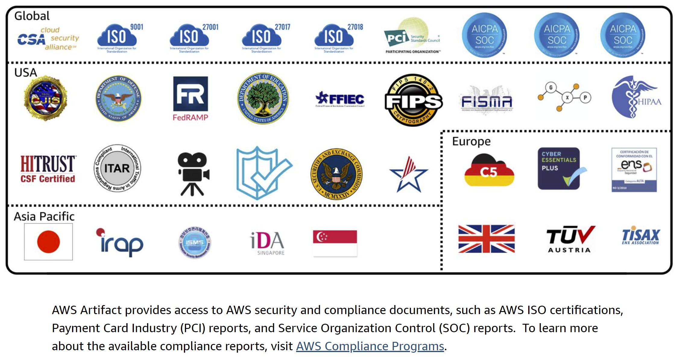

## Customer Compliance Center

The Customer Compliance Center contains resources to help you learn more about AWS compliance. 

In the Customer Compliance Center, you can read customer compliance stories to discover how companies in regulated industries have solved various compliance, governance, and audit challenges.

You can also access compliance whitepapers and documentation on topics such as:
- AWS answers to key compliance questions
- An overview of AWS risk and compliance
- An auditing security checklist

Additionally, the Customer Compliance Center includes an auditor learning path. This learning path is designed for individuals in auditing, compliance, and legal roles who want to learn more about how their internal operations can demonstrate compliance using the AWS Cloud.

## Governance and Compliance Services

### Amazon CloudWatch (free tier every month)
- Observes and monitors application performance
- Set alarms and automated actions to activate at predetermined thresholds to automatically mitigate potential issues

### Amazon CloudTrail (free tier every month)
- Generates audit trails of every action taken by a user, role, or AWS service in your account

### AWS Audit Manager (pay as you go)
- Automates evidence collection to generate audit-ready reports to prove system compliance for audits

### AWS Config (30 day free tier only)
- Provides detailed views of AWS resource configurations in your AWS account
- Tracks how configurations and relationships between resources change over time
- Monitors configuration settings and sends alerts when a resource violates your rules

## AWS Organizations

Suppose that your company has multiple AWS accounts. You can use AWS Organizations to consolidate and manage multiple AWS accounts within a central location.

When you create an organization, AWS Organizations automatically creates a root, which is the parent container for all the accounts in your organization. 

In AWS Organizations, you can centrally control permissions for the accounts in your organization by using service control policies (SCPs). SCPs enable you to place restrictions on the AWS services, resources, and individual API actions that users and roles in each account can access.

Consolidated billing is another feature of AWS Organizations

## Organizational units

In AWS Organizations, you can group accounts into organizational units (OUs) to make it easier to manage accounts with similar business or security requirements. When you apply a policy to an OU, all the accounts in the OU automatically inherit the permissions specified in the policy.  

By organizing separate accounts into OUs, you can more easily isolate workloads or applications that have specific security requirements. For instance, if your company has accounts that can access only the AWS services that meet certain regulatory requirements, you can put these accounts into one OU. Then, you can attach a policy to the OU that blocks access to all other AWS services that do not meet the regulatory requirements.

## Example AWS Organization

1. Step 1 :

  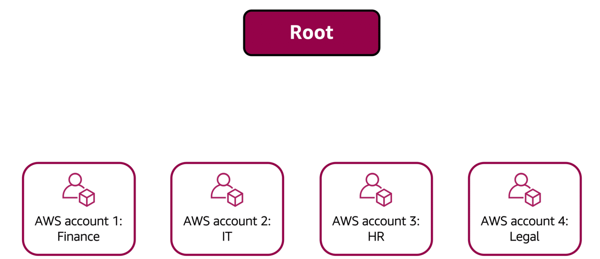

Imagine that your company has separate AWS accounts for the finance, information technology (IT), human resources (HR), and legal departments. You decide to consolidate these accounts into a single organization so that you can administer them from a central location. When you create the organization, this establishes the root.

In designing your organization, you consider the business, security, and regulatory needs of each department. You use this information to decide which departments group together in OUs.

2. Step2 :

  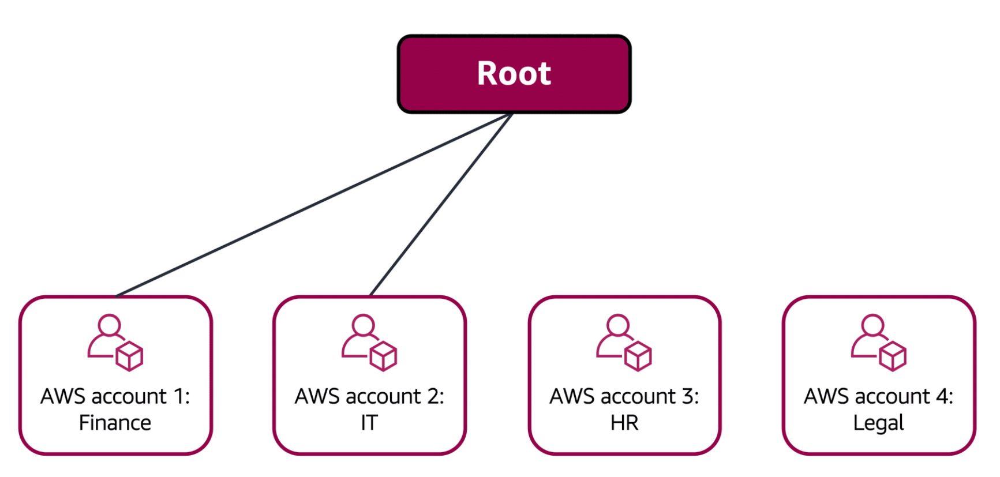

The finance and IT departments have requirements that do not overlap with those of any other department. You bring these accounts into your organization to take advantage of benefits such as consolidated billing, but you do not place them into any OUs.

3. Step3 :

  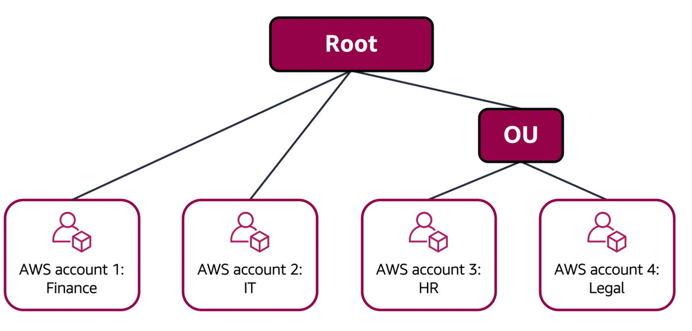

The HR and legal departments need to access the same AWS services and resources, so you place them into an OU together. Placing them into an OU empowers you to attach policies that apply to both the HR and legal departments’ AWS accounts.

In AWS Organizations, you can apply service control policies (SCPs) to the organization root, an individual member account, or an OU. An SCP affects all IAM users, groups, and roles within an account, including the AWS account root user.

You can apply IAM policies to IAM users, groups, or roles. You cannot apply an IAM policy to the AWS account root user.

## Denial-of-service attacks

Customers can call the coffee shop to place their orders. After answering each call, a cashier takes the order and gives it to the barista. 

However, suppose that a prankster is calling in multiple times to place orders but is never picking up their drinks. This causes the cashier to be unavailable to take other customers’ calls. The coffee shop can attempt to stop the false requests by blocking the phone number that the prankster is using. 

In this scenario, the prankster’s actions are similar to a denial-of-service attack.

A denial-of-service (DoS) attack is a deliberate attempt to make a website or application unavailable to users.

  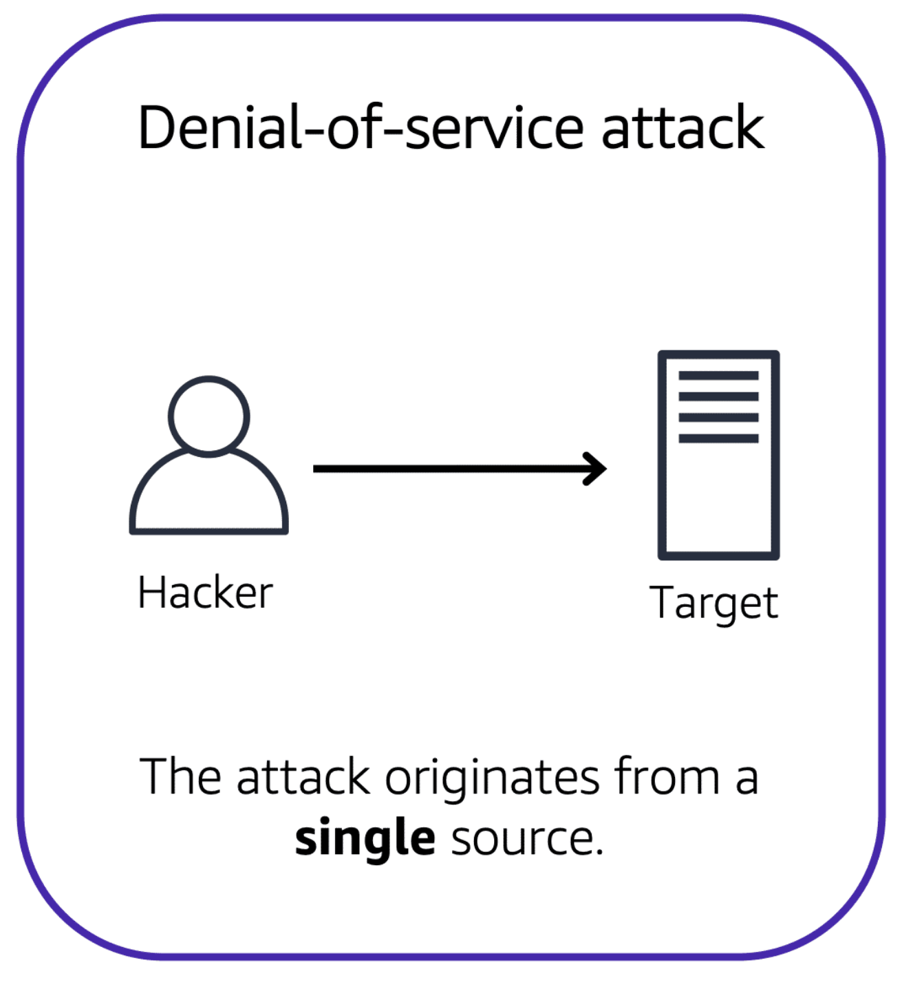

For example, an attacker might flood a website or application with excessive network traffic until the targeted website or application becomes overloaded and is no longer able to respond. If the website or application becomes unavailable, this denies service to users who are trying to make legitimate requests.

## Distributed denial-of-service attacks

Now, suppose that the prankster has enlisted the help of friends. 

The prankster and their friends repeatedly call the coffee shop with requests to place orders, even though they do not intend to pick them up. These requests are coming in from different phone numbers, and it’s impossible for the coffee shop to block them all. Additionally, the influx of calls has made it increasingly difficult for customers to be able to get their calls through. This is similar to a **distributed denial-of-service attack**.

  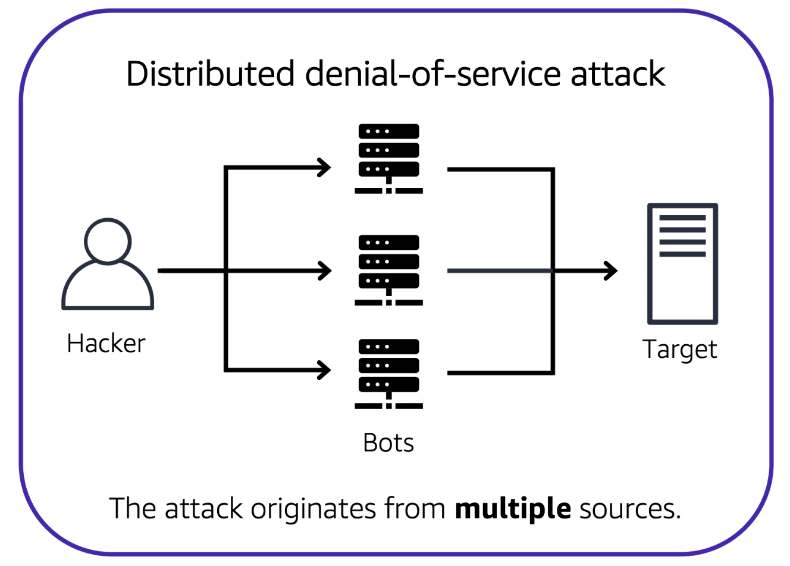

In a distributed denial-of-service (DDoS) attack, multiple sources are used to start an attack that aims to make a website or application unavailable. This can come from a group of attackers, or even a single attacker. The single attacker can use multiple infected computers (also known as “bots”) to send excessive traffic to a website or application.

To help minimize the effect of DoS and DDoS attacks on your applications, you can use AWS Shield.

## AWS Shield

AWS Shield is a service that protects applications against DDoS attacks. AWS Shield provides two levels of protection: Standard and Advanced.

To learn more about AWS Shield, expand each of the following two categories.

### AWS Shield Standard
AWS Shield Standard automatically protects all AWS customers at no cost. It protects your AWS resources from the most common, frequently occurring types of DDoS attacks. 

As network traffic comes into your applications, AWS Shield Standard uses a variety of analysis techniques to detect malicious traffic in real time and automatically mitigates it. 

### AWS Shield Advanced
AWS Shield Advanced is a paid service that provides detailed attack diagnostics and the ability to detect and mitigate sophisticated DDoS attacks. 

It also integrates with other services such as Amazon CloudFront, Amazon Route 53, and Elastic Load Balancing. Additionally, you can integrate AWS Shield with AWS WAF by writing custom rules to mitigate complex DDoS attacks.

## AWS Key Management Service (AWS KMS)

The coffee shop has many items, such as coffee machines, pastries, money in the cash registers, and so on. You can think of these items as data. The coffee shop owners want to ensure that all of these items are secure, whether they’re sitting in the storage room or being transported between shop locations. 

In the same way, you must ensure that your applications’ data is secure while in storage (encryption at rest) and while it is transmitted, known as encryption in transit.

AWS Key Management Service (AWS KMS) enables you to perform encryption operations through the use of cryptographic keys. A cryptographic key is a random string of digits used for locking (encrypting) and unlocking (decrypting) data. You can use AWS KMS to create, manage, and use cryptographic keys. You can also control the use of keys across a wide range of services and in your applications.

With AWS KMS, you can choose the specific levels of access control that you need for your keys. For example, you can specify which IAM users and roles are able to manage keys. Alternatively, you can temporarily disable keys so that they are no longer in use by anyone. Your keys never leave AWS KMS, and you are always in control of them.

## AWS WAF

AWS WAF is a web application firewall that lets you monitor network requests that come into your web applications. 

AWS WAF works together with Amazon CloudFront and an Application Load Balancer. Recall the network access control lists that you learned about in an earlier module. AWS WAF works in a similar way to block or allow traffic. However, it does this by using a web access control list (ACL) to protect your AWS resources. 

Here’s an example of how you can use AWS WAF to allow and block specific requests.

  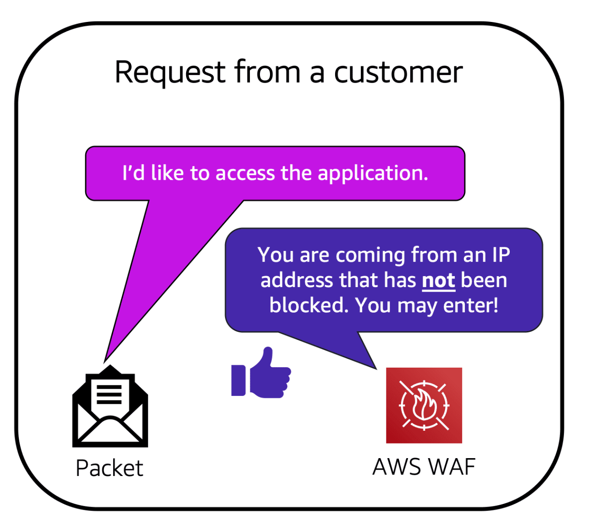

Suppose that your application has been receiving malicious network requests from several IP addresses. You want to prevent these requests from continuing to access your application, but you also want to ensure that legitimate users can still access it. You configure the web ACL to allow all requests except those from the IP addresses that you have specified.

When a request comes into AWS WAF, it checks against the list of rules that you have configured in the web ACL. If a request does not come from one of the blocked IP addresses, it allows access to the application.

  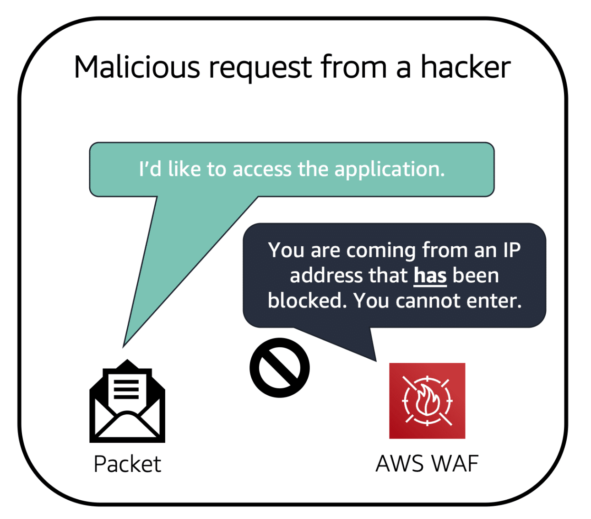

However, if a request comes from one of the blocked IP addresses that you have specified in the web ACL, AWS WAF denies access.

## Amazon Inspector

Suppose that the developers at the coffee shop are developing and testing a new ordering application. They want to make sure that they are designing the application in accordance with security best practices. However, they have several other applications to develop, so they cannot spend much time conducting manual assessments. To perform automated security assessments, they decide to use Amazon Inspector.

Amazon Inspector helps to improve the security and compliance of applications by running automated security assessments. It checks applications for security vulnerabilities and deviations from security best practices, such as open access to Amazon EC2 instances and installations of vulnerable software versions. 

After Amazon Inspector has performed an assessment, it provides you with a list of security findings. The list prioritizes by severity level, including a detailed description of each security issue and a recommendation for how to fix it. However, AWS does not guarantee that following the provided recommendations resolves every potential security issue. Under the shared responsibility model, customers are responsible for the security of their applications, processes, and tools that run on AWS services.

