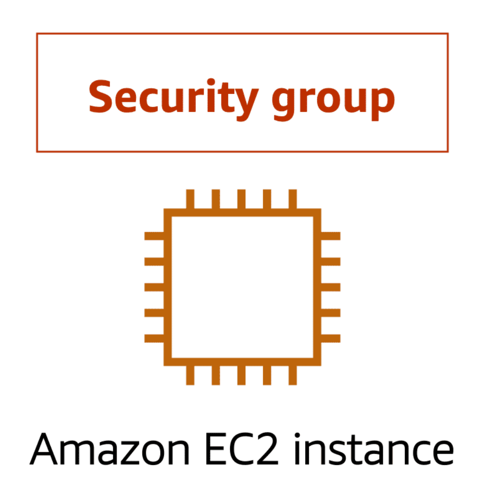
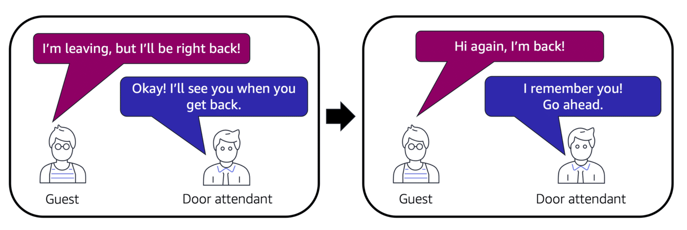

# AWS Global Infrastructure

## Availability Zones (AZs)

An Availability Zone is a single data center or a group of data centers within a Region. Availability Zones are located tens of miles apart from each other. This is close enough to have low latency (the time between when content requested and received) between Availability Zones. However, if a disaster occurs in one part of the Region, they are distant enough to reduce the chance that multiple Availability Zones are affected.

  

- discrete data centers around the world, seperated from each other by network, power source, and a meaningful distance
- high availability: hosting resources in multiple AZs
- Fault tolerance: ability to provide uninterrupted performance even during natural/human-made disasters
- Resiliency: capacity to recover from disasters quickly

## Region
- two or more availability zones
- All AZs within a region are interconnected with high-bandwidth, low-latency networking
- Different regions have different AWS Cloud offerings
- Generally choose the Region closest to your physical location
- Can host resources in multiple regions for many reasons

## AWS Wavelength Zones
- provides ultra-low-latency user experience for application end users by embedding AWS compute and storage services within 5G networks
- provides mobile edge computing infrastructure to develop, deploy, and scale ultra-low-latency application

# Compute Services

## Amazon Elastic Compute Cloud (EC2)
Amazon EC2 is a highly flexible, scalable, and customizable **cloud computing service that provides the virtual infrastructure needed to run various applications and workloads**. It allows businesses to avoid the upfront costs of physical hardware and scale their compute resources dynamically based on demand.

Amazon Elastic Compute Cloud (Amazon EC2) provides secure, resizable compute capacity in the cloud as Amazon EC2 instances. 

Imagine you are responsible for the architecture of your company's resources and need to support new websites. With traditional on-premises resources, you have to do the following:

- Spend money upfront to purchase hardware.
- Wait for the servers to be delivered to you.
- Install the servers in your physical data center.
- Make all the necessary configurations.

By comparison, with an Amazon EC2 instance you can use a virtual server to run applications in the AWS Cloud.

- You can provision and launch an Amazon EC2 instance within minutes.
- You can stop using it when you have finished running a workload.
- You pay only for the compute time you use when an instance is running, not when it is stopped or terminated.
- You can save costs by paying only for server capacity that you need or want.

### How Amazon EC2 works
1. Launch

First, you launch an instance. Begin by selecting a template with basic configurations for your instance. These configurations include the operating system, application server, or applications. You also select the instance type, which is the specific hardware configuration of your instance. 

As you are preparing to launch an instance, you specify security settings to control the network traffic that can flow into and out of your instance. Later in this course, we will explore Amazon EC2 security features in greater detail.

2. Connect

Next, connect to the instance. You can connect to the instance in several ways. Your programs and applications have multiple different methods to connect directly to the instance and exchange data. Users can also connect to the instance by logging in and accessing the computer desktop.

3. Use

After you have connected to the instance, you can begin using it. You can run commands to install software, add storage, copy and organize files, and more.

### Amazon EC2 instance types

Amazon EC2 instance types are optimized for different tasks. When selecting an instance type, consider the specific needs of your workloads and applications. This might include requirements for compute, memory, or storage capabilities.

To learn more about Amazon EC2 instance types, expand each of the following five categories.

1. General purpose instances
General purpose instances provide a **balance of compute, memory, and networking resources**. You can use them for a variety of workloads, such as:

- application servers
- gaming servers
- backend servers for enterprise applications
- small and medium databases

Suppose that you have an application in which the resource needs for compute, memory, and networking are roughly equivalent. You might consider running it on a general purpose instance because the application does not require optimization in any single resource area.

2. Compute optimized instances
Compute optimized instances are ideal for compute-bound applications that benefit from **high-performance processors**. Like general purpose instances, you can use compute optimized instances for workloads such as web, application, and gaming servers.

However, the difference is compute optimized applications are ideal for high-performance web servers, **compute-intensive applications** servers, and dedicated gaming servers. You can also use compute optimized instances for batch processing workloads that require processing many transactions in a single group.

3. Memory optimized instances
Memory optimized instances are designed to deliver fast performance for workloads that process large datasets in memory. In computing, memory is a temporary storage area. It holds all the data and instructions that a central processing unit (CPU) needs to be able to complete actions. Before a computer program or application is able to run, it is loaded from storage into memory. This preloading process gives the CPU direct access to the computer program.

Suppose that you have a workload that requires large amounts of data to be preloaded before running an application. This scenario might be a high-performance database or a workload that involves performing real-time processing of a large amount of unstructured data. In these types of use cases, consider using a memory optimized instance. Memory optimized instances enable you to run workloads with high memory needs and receive great performance.

4. Accelerated computing instances
Accelerated computing instances use hardware accelerators, or coprocessors, to perform some functions more efficiently than is possible in software running on CPUs. Examples of these functions include floating-point number calculations, graphics processing, and data pattern matching.

In computing, a hardware accelerator is a component that can expedite data processing. Accelerated computing instances are ideal for workloads such as graphics applications, game streaming, and application streaming.

5. Storage optimized instances
 
Storage optimized instances are designed for workloads that require high, sequential read and write access to large datasets on local storage. Examples of workloads suitable for storage optimized instances include distributed file systems, data warehousing applications, and high-frequency online transaction processing (OLTP) systems.

In computing, the term input/output operations per second (IOPS) is a metric that measures the performance of a storage device. It indicates how many different input or output operations a device can perform in one second. Storage optimized instances are designed to deliver tens of thousands of low-latency, random IOPS to applications. 

You can think of input operations as data put into a system, such as records entered into a database. An output operation is data generated by a server. An example of output might be the analytics performed on the records in a database. If you have an application that has a high IOPS requirement, a storage optimized instance can provide better performance over other instance types not optimized for this kind of use case.

### Amazon EC2 pricing
With Amazon EC2, you pay only for the compute time that you use. Amazon EC2 offers a variety of pricing options for different use cases. For example, if your use case can withstand interruptions, you can save with Spot Instances. You can also save by committing early and locking in a minimum level of use with Reserved Instances.

Five categories:
1. On-Demand
On-Demand Instances are ideal **for short-term**, **irregular workloads** that cannot be interrupted. No upfront costs or minimum contracts apply. The instances run continuously until you stop them, and you pay for only the compute time you use.

Sample use cases for On-Demand Instances include developing and testing applications and running applications that have unpredictable usage patterns. On-Demand Instances are not recommended for workloads that last a year or longer because these workloads can experience greater cost savings using Reserved Instances.

2. Reserved Instances
Reserved Instances are a billing discount applied to the use of On-Demand Instances in your account. There are two available types of Reserved Instances:

- Standard Reserved Instances
- Convertible Reserved Instances

You can purchase Standard Reserved and Convertible Reserved Instances for a 1-year or 3-year term. You realize greater cost savings with the 3-year option. 

Standard Reserved Instances: This option is a good fit if you know the EC2 instance type and size you need for your steady-state applications and in which AWS Region you plan to run them. Reserved Instances require you to state the following qualifications:

- Instance type and size: For example, m5.xlarge
- Platform description (operating system): For example, Microsoft Windows Server or Red Hat Enterprise Linux
- Tenancy: Default tenancy or dedicated tenancy

You have the option to specify an Availability Zone for your EC2 Reserved Instances. If you make this specification, you get EC2 capacity reservation. This ensures that your desired amount of EC2 instances will be available when you need them. 

Convertible Reserved Instances: If you need to run your EC2 instances in different Availability Zones or different instance types, then Convertible Reserved Instances might be right for you. Note: You trade in a deeper discount when you require flexibility to run your EC2 instances.

At the end of a Reserved Instance term, you can continue using the Amazon EC2 instance without interruption. However, you are charged On-Demand rates until you do one of the following:

- Terminate the instance.
- Purchase a new Reserved Instance that matches the instance attributes (instance family and size, Region, platform, and tenancy).

3. EC2 Instance Savings Plans
AWS offers Savings Plans for a few compute services, including Amazon EC2. EC2 Instance Savings Plans reduce your EC2 instance costs when you make an hourly spend commitment to an instance family and Region for a 1-year or 3-year term. This term commitment results in savings of up to 72 percent compared to On-Demand rates. Any usage up to the commitment is charged at the discounted Savings Plans rate (for example, $10 per hour). Any usage beyond the commitment is charged at regular On-Demand rates.

The EC2 Instance Savings Plans are a good option if you need flexibility in your Amazon EC2 usage over the duration of the commitment term. You have the benefit of saving costs on running any EC2 instance within an EC2 instance family in a chosen Region (for example, M5 usage in N. Virginia) regardless of Availability Zone, instance size, OS, or tenancy. The savings with EC2 Instance Savings Plans are similar to the savings provided by Standard Reserved Instances.

Unlike Reserved Instances, however, **you don't need to specify up front what EC2 instance type and size** (for example, m5.xlarge), **OS**, and **tenancy to get a discount**. Further, you don't need to commit to a certain number of EC2 instances over a 1-year or 3-year term. Additionally, the EC2 Instance Savings Plans don't include an EC2 capacity reservation option.

Later in this course, you'll review AWS Cost Explorer, which you can use to visualize, understand, and manage your AWS costs and usage over time. If you're considering your options for Savings Plans, you can use AWS Cost Explorer to analyze your Amazon EC2 usage over the past 7, 30, or 60 days. AWS Cost Explorer also provides customized recommendations for Savings Plans. These recommendations estimate how much you could save on your monthly Amazon EC2 costs, based on previous Amazon EC2 usage and the hourly commitment amount in a 1-year or 3-year Savings Plan.

4. Spot Instances
Spot Instances are ideal for workloads with flexible start and end times, or that can withstand interruptions. Spot Instances use unused Amazon EC2 computing capacity and offer you cost savings at up to 90% off of On-Demand prices.

Suppose that you have a background processing job that can start and stop as needed (such as the data processing job for a customer survey). You want to start and stop the processing job without affecting the overall operations of your business. If you make a Spot request and Amazon EC2 capacity is available, your Spot Instance launches. However, if you make a Spot request and Amazon EC2 capacity is unavailable, the request is not successful until capacity becomes available. The unavailable capacity might delay the launch of your background processing job.

After you have launched a Spot Instance, if capacity is no longer available or demand for Spot Instances increases, your instance may be interrupted. This might not pose any issues for your background processing job. However, in the earlier example of developing and testing applications, you would most likely want to avoid unexpected interruptions. Therefore, choose a different EC2 instance type that is ideal for those tasks.

5. Dedicated Hosts
Dedicated Hosts are physical servers with Amazon EC2 instance capacity that is fully dedicated to your use. 

You can use your existing per-socket, per-core, or per-VM software licenses to help maintain license compliance. You can purchase On-Demand Dedicated Hosts and Dedicated Hosts Reservations. Of all the Amazon EC2 options that were covered, Dedicated Hosts are the most expensive.

### Scalability

Scalability involves beginning with only the resources you need and designing your architecture to automatically respond to changing demand by scaling out or in. As a result, you pay for only the resources you use. You don’t have to worry about a lack of computing capacity to meet your customers’ needs.

If you wanted the scaling process to happen automatically, which AWS service would you use? The AWS service that provides this functionality for Amazon EC2 instances is Amazon EC2 Auto Scaling.

### Amazon EC2 Auto Scaling

If you’ve tried to access a website that wouldn’t load and frequently timed out, the website might have received more requests than it was able to handle. This situation is similar to waiting in a long line at a coffee shop, when there is only one barista present to take orders from customers.

Amazon EC2 Auto Scaling enables you to automatically add or remove Amazon EC2 instances in response to changing application demand. By automatically scaling your instances in and out as needed, you can maintain a greater sense of application availability.

Within Amazon EC2 Auto Scaling, you can use two approaches: **dynamic scaling** and **predictive scaling**.

- Dynamic scaling responds to changing demand. 
- Predictive scaling automatically schedules the right number of Amazon EC2 instances based on predicted demand.

### Example: Amazon EC2 Auto Scaling

In the cloud, computing power is a programmatic resource, so you can take a more flexible approach to the issue of scaling. By adding Amazon EC2 Auto Scaling to an application, you can add new instances to the application when necessary and terminate them when no longer needed.

Suppose that you are preparing to launch an application on Amazon EC2 instances. When configuring the size of your Auto Scaling group, you might set the minimum number of Amazon EC2 instances at one. This means that at all times, there must be at least one Amazon EC2 instance running.

When you create an Auto Scaling group, you can set the minimum number of Amazon EC2 instances. The minimum capacity is the number of Amazon EC2 instances that launch immediately after you have created the Auto Scaling group. In this example, the Auto Scaling group has a minimum capacity of one Amazon EC2 instance.

Next, you can set the desired capacity at two Amazon EC2 instances even though your application needs a minimum of a single Amazon EC2 instance to run.

The third configuration that you can set in an Auto Scaling group is the maximum capacity. For example, you might configure the Auto Scaling group to scale out in response to increased demand, but only to a maximum of four Amazon EC2 instances.

Because Amazon EC2 Auto Scaling uses Amazon EC2 instances, you pay for only the instances you use, when you use them. You now have a cost-effective architecture that provides the best customer experience while reducing expenses.

## Elastic Load Balancing

Elastic Load Balancing is the AWS service that automatically distributes incoming application traffic across multiple resources, such as Amazon EC2 instances. 

A load balancer acts as a single point of contact for all incoming web traffic to your Auto Scaling group. This means that as you add or remove Amazon EC2 instances in response to the amount of incoming traffic, these requests route to the load balancer first. Then, the requests spread across multiple resources that will handle them. For example, if you have multiple Amazon EC2 instances, Elastic Load Balancing distributes the workload across the multiple instances so that no single instance has to carry the bulk of it. 

Although Elastic Load Balancing and Amazon EC2 Auto Scaling are separate services, they work together to help ensure that applications running in Amazon EC2 can provide high performance and availability. 

### Example: Elastic Load Balancing

1. Low-demand period

Here’s an example of how Elastic Load Balancing works. Suppose that a few customers have come to the coffee shop and are ready to place their orders. 

If only a few registers are open, this matches the demand of customers who need service. The coffee shop is less likely to have open registers with no customers. In this example, you can think of the registers as Amazon EC2 instances.

2. High-demand period

Throughout the day, as the number of customers increases, the coffee shop opens more registers to accommodate them. 

Additionally, a coffee shop employee directs customers to the most appropriate register so that the number of requests can evenly distribute across the open registers. You can think of this coffee shop employee as a load balancer. 

## AWS Elastic Beanstalk (free to use)

With AWS Elastic Beanstalk, you provide code and configuration settings, and Elastic Beanstalk deploys the resources necessary to perform the following tasks:

1. Adjust capacity
2. Load balancing
3. Automatic scaling
4. Application health monitoring

- handles deployment process
- accomodates services developed using Java, .NET, PHP, Node.js, Python, Ruby, Go, and Docker
- You retain control over resources at all time
- pay only for other AWS recourses consumed to deploy
- it is autoscaling
- complete freedom to select AWS resources
- allows manual management of infrastructure
- provisions and operates the infrastructure

## AWS CloudFormation

With AWS CloudFormation, you can treat your **infrastructure as code**. This means that you can build an environment by writing lines of code instead of using the AWS Management Console to individually provision resources.

AWS CloudFormation provisions your resources in a safe, repeatable manner, enabling you to frequently build your infrastructure and applications without having to perform manual actions. It determines the right operations to perform when managing your stack and rolls back changes automatically if it detects errors.

## Messaging and Queuing

### Monolithic applications and microservices

Applications are made of multiple components. The components communicate with each other to transmit data, fulfill requests, and keep the application running. 

Suppose that you have an application with tightly coupled components. These components might include databases, servers, the user interface, business logic, and so on. This type of architecture can be considered a monolithic application. 

In this approach to application architecture, if a single component fails, other components fail, and possibly the entire application fails.

To help maintain application availability when a single component fails, you can design your application through a microservices approach.

In a microservices approach, application components are loosely coupled. In this case, if a single component fails, the other components continue to work because they are communicating with each other. The loose coupling prevents the entire application from failing. 

When designing applications on AWS, you can take a microservices approach with services and components that fulfill different functions. Two services facilitate application integration: Amazon Simple Notification Service (Amazon SNS) and Amazon Simple Queue Service (Amazon SQS).

### Amazon Simple Notification Service (Amazon SNS)

Amazon Simple Notification Service (Amazon SNS) is a publish/subscribe service. Using Amazon SNS topics, a publisher publishes messages to subscribers. This is similar to the coffee shop; the cashier provides coffee orders to the barista who makes the drinks.

In Amazon SNS, subscribers can be web servers, email addresses, AWS Lambda functions, or several other options. 

  

Suppose that the coffee shop has a single newsletter that includes updates from all areas of its business. It includes topics such as coupons, coffee trivia, and new products. All of these topics are grouped because this is a single newsletter. All customers who subscribe to the newsletter receive updates about coupons, coffee trivia, and new products.

After a while, some customers express that they would prefer to receive separate newsletters for only the specific topics that interest them. The coffee shop owners decide to try this approach.

  

Now, instead of having a single newsletter for all topics, the coffee shop has broken it up into three separate newsletters. Each newsletter is devoted to a specific topic: coupons, coffee trivia, and new products.

Subscribers will now receive updates immediately for only the specific topics to which they have subscribed.

It is possible for subscribers to subscribe to a single topic or to multiple topics. For example, the first customer subscribes to only the coupons topic, and the second subscriber subscribes to only the coffee trivia topic. The third customer subscribes to both the coffee trivia and new products topics.

### Amazon Simple Queue Service (Amazon SQS)

Amazon Simple Queue Service (Amazon SQS) is a message queuing service. 

Using Amazon SQS, you can send, store, and receive messages between software components, without losing messages or requiring other services to be available. In Amazon SQS, an application sends messages into a queue. A user or service retrieves a message from the queue, processes it, and then deletes it from the queue.

To review two examples of how to use Amazon SQS, choose the arrow buttons to display each one.

  

Suppose that the coffee shop has an ordering process in which a cashier takes orders, and a barista makes the orders. Think of the cashier and the barista as two separate components of an application. 

First, the cashier takes an order and writes it down on a piece of paper. Next, the cashier delivers the paper to the barista. Finally, the barista makes the drink and gives it to the customer.

When the next order comes in, the process repeats. This process runs smoothly as long as both the cashier and the barista are coordinated.

What might happen if the cashier took an order and went to deliver it to the barista, but the barista was out on a break or busy with another order? The cashier would need to wait until the barista is ready to accept the order. This would cause delays in the ordering process and require customers to wait longer to receive their orders.

As the coffee shop has become more popular and the ordering line is moving more slowly, the owners notice that the current ordering process is time consuming and inefficient. They decide to try a different approach that uses a queue.

  

Recall that the cashier and the barista are two separate components of an application. A message queuing service, such as Amazon SQS, lets messages between decoupled application complements.

In this example, the first step in the process remains the same as before: a customer places an order with the cashier. 

The cashier puts the order into a queue. You can think of this as an order board that serves as a buffer between the cashier and the barista. Even if the barista is out on a break or busy with another order, the cashier can continue placing new orders into the queue. 

Next, the barista checks the queue and retrieves the order.

The barista prepares the drink and gives it to the customer. 

The barista then removes the completed order from the queue. 

While the barista is preparing the drink, the cashier is able to continue taking new orders and add them to the queue.

## Serverless computing

Earlier in this module, you learned about Amazon EC2, a service that lets you run virtual servers in the cloud. If you have applications that you want to run in Amazon EC2, you must do the following:

1. Provision instances (virtual servers).

2. Upload your code.

3. Continue to manage the instances while your application is running.

  

The term “serverless” means that your code runs on servers, but you do not need to provision or manage these servers. With serverless computing, you can focus more on innovating new products and features instead of maintaining servers.

Another benefit of serverless computing is the flexibility to scale serverless applications automatically. Serverless computing can adjust the applications' capacity by modifying the units of consumptions, such as throughput and memory. 

An AWS service for serverless computing is AWS Lambda.

### AWS Lambda

AWS Lambda is a service that lets you run code without needing to provision or manage servers. 

While using AWS Lambda, you pay only for the compute time that you consume. Charges apply only when your code is running. You can also run code for virtually any type of application or backend service, all with zero administration. 

For example, a simple Lambda function might involve automatically resizing uploaded images to the AWS Cloud. In this case, the function triggers when uploading a new image. 

### How AWS Lambda works

  

1. You upload your code to Lambda. 

2. You set your code to trigger from an event source, such as AWS services, mobile applications, or HTTP endpoints.

3. Lambda runs your code only when triggered.

4. You pay only for the compute time that you use. In the previous example of resizing images, you would pay only for the compute time that you use when uploading new images. Uploading the images triggers Lambda to run code for the image resizing function.

## Containerized applications

### Containers

Containers provide you with a standard way to package your application's code and dependencies into a single object. You can also use containers for processes and workflows in which there are essential requirements for security, reliability, and scalability.

To review an example on how containers work, choose the arrow buttons.

  

Suppose that a company’s application developer has an environment on their computer that is different from the environment on the computers used by the IT operations staff. The developer wants to ensure that the application’s environment remains consistent regardless of deployment, so they use a containerized approach. This helps to reduce time spent debugging applications and diagnosing differences in computing environments.

  

When running containerized applications, it’s important to consider scalability. Suppose that instead of a single host with multiple containers, you have to manage tens of hosts with hundreds of containers. Alternatively, you have to manage possibly hundreds of hosts with thousands of containers. At a large scale, imagine how much time it might take for you to monitor memory usage, security, logging, and so on.

### Amazon Elastic Container Service (Amazon ECS)

Amazon Elastic Container Service (Amazon ECS) is a highly scalable, high-performance container management system that enables you to run and scale containerized applications on AWS. 

Amazon ECS **supports Docker containers**. Docker is a software platform that enables you to build, test, and deploy applications quickly. AWS supports the use of open-source Docker Community Edition and subscription-based Docker Enterprise Edition. With Amazon ECS, you can use API calls to launch and stop Docker-enabled applications.

### Amazon Elastic Kubernetes Service (Amazon EKS)

Amazon Elastic Kubernetes Service (Amazon EKS) is a fully managed service that you can use to run Kubernetes on AWS. 

Kubernetes is open-source software that enables you to deploy and manage containerized applications at scale. A large community of volunteers maintains Kubernetes, and AWS actively works together with the Kubernetes community. As new features and functionalities release for Kubernetes applications, you can easily apply these updates to your applications managed by Amazon EKS.

### AWS Fargate

AWS Fargate is a **serverless compute engine for containers**. It works with both Amazon ECS and Amazon EKS. 

When using AWS Fargate, you do not need to provision or manage servers. AWS Fargate manages your server infrastructure for you. You can focus more on innovating and developing your applications, and you pay only for the resources that are required to run your containers.

## Difference between Lambda and Fargate

AWS Lambda and AWS Fargate are both serverless computing services provided by AWS, but they serve different purposes and are used for different types of workloads. Here's a breakdown of the differences between the two:

AWS Lambda:
1. Purpose:

Function-as-a-Service (FaaS): AWS Lambda is designed for running small, single-purpose functions or tasks that are triggered by events. It is best suited for event-driven architectures, where your code is executed in response to specific events like changes in data, user actions, or HTTP requests.
2. Execution Model:

Short-lived and Stateless: Lambda functions are short-lived and stateless. They are meant to execute quickly (with a maximum execution time of 15 minutes) and do not retain state between invocations. If you need to maintain state, you would typically use external services like Amazon S3, DynamoDB, or RDS.
3. Scaling:

Automatic Scaling: Lambda automatically scales the number of instances of your function to handle incoming requests. You don't need to manage scaling manually; Lambda will scale up and down based on demand.
4. Cost:

Pay-per-Execution: With Lambda, you only pay for the compute time your code consumes, measured in milliseconds, and the number of requests. This makes it cost-effective for workloads with unpredictable or sporadic demand.
5. Use Cases:

Event-driven tasks: Such as file processing in S3, responding to API Gateway requests, or processing messages in an SQS queue.
Automated backend tasks: Like triggering functions based on events in your application.
Microservices: Running small, modular services that perform specific functions.
AWS Fargate:
1. Purpose:

Container-as-a-Service (CaaS): AWS Fargate is designed for running containerized applications without needing to manage the underlying infrastructure. It is used with Amazon ECS (Elastic Container Service) or Amazon EKS (Elastic Kubernetes Service) to run containers in a serverless manner.
2. Execution Model:

Long-lived and Stateful/Stateless: Fargate can run both long-running services and short-lived tasks. Containers can be stateful or stateless, depending on how you design your application. You can use persistent storage like EBS or EFS if needed.
3. Scaling:

Managed Scaling: Fargate automatically provisions the necessary compute resources for your containers. You can scale your containers based on demand, either manually or through Auto Scaling policies.
4. Cost:

Pay-for-Resources: With Fargate, you pay for the vCPU and memory resources that your containers use. This makes it suitable for more predictable workloads where you need finer control over the resources allocated to your containers.
5. Use Cases:

Microservices: Running containerized microservices with a focus on portability and consistency across environments.
Batch Processing: Running batch jobs in containers that may require more resources or longer execution times.
Web Applications: Deploying web applications and APIs in containers that need to run continuously.
CI/CD Pipelines: Running containerized tasks for continuous integration and deployment workflows.
Key Differences:
Execution Model:

Lambda: Stateless, short-lived functions triggered by events (maximum execution time of 15 minutes).
Fargate: Long-lived or short-lived containers that can be stateful or stateless, with more flexibility in execution time.
Workload Type:

Lambda: Best for event-driven tasks and small, modular functions.
Fargate: Best for running containerized applications and services, whether they are short-lived tasks or long-running services.
Scaling:

Lambda: Automatically scales based on the number of incoming requests or events.
Fargate: Scales based on the number of running containers, with finer control over resources.
Pricing:

Lambda: Pay-per-execution, measured in milliseconds.
Fargate: Pay for vCPU and memory resources used by containers.
Use Cases:

Lambda: Ideal for lightweight, event-driven tasks or automation scripts.
Fargate: Ideal for running full-fledged containerized applications, microservices, or batch processing tasks.
When to Use AWS Lambda:
When you need to run small, event-driven functions that execute in response to specific triggers.
For workloads with unpredictable demand, where you only want to pay for the actual compute time used.
For scenarios where you don't need to manage servers or containers and prefer a fully managed experience.
When to Use AWS Fargate:
When you need to run containerized applications that require specific resources, such as CPU and memory.
For workloads where you want the flexibility of containers but without the need to manage the underlying infrastructure.
When you need long-running or stateful applications, and want to leverage container orchestration with ECS or EKS.
In summary, while both services offer serverless compute capabilities, AWS Lambda is better suited for short-lived, event-driven functions, whereas AWS Fargate is designed for running containerized applications that may need more control over resources and execution time.

## Amazon Lightsail

Amazon Lightsail is a simplified, cost-effective cloud platform provided by AWS. It is designed to make it easy for developers, small businesses, and individuals to deploy and manage small-scale applications or websites without needing to deal with the complexity of more advanced AWS services.

### Key Features of Amazon Lightsail:

#### Virtual Private Servers (VPS)
- Lightsail provides pre-configured virtual private servers (instances) with a fixed amount of compute, memory, and storage. These servers are easy to deploy and manage, and you can choose from a range of operating systems and application stacks.

#### Preconfigured Application Stacks
- Lightsail offers blueprints for popular applications and development stacks, such as WordPress, LAMP (Linux, Apache, MySQL, PHP), Node.js, and more. This allows you to quickly launch applications with minimal setup.

#### Simplified Management
- Lightsail provides an easy-to-use interface for managing your resources, including instances, databases, load balancers, and networking. The interface is designed to be user-friend

# Network Services

## Amazon Virtual Private Cloud (VPC)
- logically isolated section in the cloud to provision resources
- flexible and secure, allowing you to control almost every aspect of your virtual network
- vpc automatically provisioned at AWS account sign-up

Imagine the millions of customers who use AWS services. Also, imagine the millions of resources that these customers have created, such as Amazon EC2 instances. Without boundaries around all of these resources, network traffic would be able to flow between them unrestricted. 

A networking service that you can use to establish boundaries around your AWS resources is Amazon Virtual Private Cloud (Amazon VPC).

Amazon VPC enables you to provision an isolated section of the AWS Cloud. In this isolated section, you can launch resources in a virtual network that you define. Within a virtual private cloud (VPC), you can organize your resources into **subnets**. A **subnet** is a section of a VPC that can contain resources such as Amazon EC2 instances.

### Internet gateway

To allow public traffic from the internet to access your VPC, you attach an internet gateway to the VPC.

  

An internet gateway is a connection between a VPC and the internet. You can think of an internet gateway as being similar to a doorway that customers use to enter the coffee shop. Without an internet gateway, no one can access the resources within your VPC.

### Virtual private gateway

To access private resources in a VPC, you can use a virtual private gateway. 

Here’s an example of how a virtual private gateway works. You can think of the internet as the road between your home and the coffee shop. Suppose that you are traveling on this road with a bodyguard to protect you. You are still using the same road as other customers, but with an extra layer of protection. 

The bodyguard is like a virtual private network (VPN) connection that encrypts (or protects) your internet traffic from all the other requests around it. 

The virtual private gateway is the component that allows protected internet traffic to enter into the VPC. Even though your connection to the coffee shop has extra protection, traffic jams are possible because you’re using the same road as other customers. 

  

A virtual private gateway enables you to establish a virtual private network (VPN) connection between your VPC and a private network, such as an on-premises data center or internal corporate network. A virtual private gateway allows traffic into the VPC only if it is coming from an approved network.

### AWS Direct Connect

AWS Direct Connect is a service that lets you to establish a dedicated private connection between your data center and a VPC.  

Suppose that there is an apartment building with a hallway directly linking the building to the coffee shop. Only the residents of the apartment building can travel through this hallway. 

This private hallway provides the same type of dedicated connection as AWS Direct Connect. Residents are able to get into the coffee shop without needing to use the public road shared with other customers.

  

The private connection that AWS Direct Connect provides helps you to reduce network costs and increase the amount of bandwidth that can travel through your network.

### 
Here’s a sample README file that differentiates between Internet Gateway, Virtual Private Gateway, and AWS Direct Connect, along with their use cases.

AWS Connectivity Options: Internet Gateway, Virtual Private Gateway, and AWS Direct Connect
In AWS, there are several options for connecting your Virtual Private Cloud (VPC) to other networks. This document covers three of the most common options: Internet Gateway (IGW), Virtual Private Gateway (VGW), and AWS Direct Connect.

### Comparison Summary:

| **Feature**                   | **Internet Gateway (IGW)**                        | **Virtual Private Gateway (VGW)**                  | **AWS Direct Connect**                             |
|--------------------------------|--------------------------------------------------|---------------------------------------------------|---------------------------------------------------|
| **Purpose**                    | Public internet access for VPC resources         | Secure VPN connection to on-premises or another VPC| Dedicated, private connection to on-premises       |
| **Use Cases**                  | Hosting public-facing apps, internet access      | Hybrid cloud setups, secure data transfer          | High-volume data transfer, low-latency apps        |
| **Traffic Type**               | Public internet traffic                          | Encrypted traffic over VPN                         | Private network traffic                            |
| **Security**                   | Public (requires proper security group and NACLs)| Encrypted VPN tunnel                               | Private, dedicated line                            |
| **Performance**                | Varies based on internet conditions              | Varies based on internet conditions                | Consistent, high-bandwidth, low-latency            |
| **Typical Use Case Example**   | Hosting a web server                             | Extending on-premises network to AWS               | Transferring large data sets between data centers  |

## Subnets and Network Access Control Lists
To learn more about the role of subnets within a VPC, review the following example from the coffee shop.

First, customers give their orders to the cashier. The cashier then passes the orders to the barista. This process allows the line to keep running smoothly as more customers come in. 

Suppose that some customers try to skip the cashier line and give their orders directly to the barista. This disrupts the flow of traffic and results in customers accessing a part of the coffee shop that is restricted to them.

  

To fix this, the owners of the coffee shop divide the counter area by placing the cashier and the barista in separate workstations. The cashier’s workstation is public facing and designed to receive customers. The barista’s area is private. The barista can still receive orders from the cashier but not directly from customers.

  

This is similar to how you can use AWS networking services to isolate resources and determine exactly how network traffic flows.

In the coffee shop, you can think of the counter area as a VPC. The counter area divides into two separate areas for the cashier’s workstation and the barista’s workstation. In a VPC, subnets are separate areas that are used to group together resources.

### Subnets

A subnet is a section of a VPC in which you can group resources based on security or operational needs. Subnets can be public or private. 

**Public subnets** contain resources that need to be accessible by the public, such as an online store’s website.

**Private subnets** contain resources that should be accessible only through your private network, such as a database that contains customers’ personal information and order histories. 

In a VPC, subnets can communicate with each other. For example, you might have an application that involves Amazon EC2 instances in a public subnet communicating with databases that are located in a private subnet.

  

### Network traffic in a VPC

When a customer requests data from an application hosted in the AWS Cloud, this request is sent as a packet. A packet is a unit of data sent over the internet or a network. 

It enters into a VPC through an internet gateway. Before a packet can enter into a subnet or exit from a subnet, it checks for permissions. These permissions indicate who sent the packet and how the packet is trying to communicate with the resources in a subnet.

The VPC component that checks packet permissions for subnets is a network access control list (ACL).

### Network ACLs

A network ACL is a virtual firewall that controls inbound and outbound traffic at the **subnet level**.

For example, step outside of the coffee shop and imagine that you are in an airport. In the airport, travelers are trying to enter into a different country. You can think of the travelers as packets and the passport control officer as a network ACL. The passport control officer checks travelers’ credentials when they are both entering and exiting out of the country. If a traveler is on an approved list, they are able to get through. However, if they are not on the approved list or are explicitly on a list of banned travelers, they cannot come in.

Each AWS account includes a default network ACL. When configuring your VPC, you can use your account’s default network ACL or create custom network ACLs. 

By default, your account’s default network ACL allows all inbound and outbound traffic, but you can modify it by adding your own rules. For custom network ACLs, all inbound and outbound traffic is denied until you add rules to specify which traffic to allow. Additionally, all network ACLs have an explicit deny rule. This rule ensures that if a packet doesn’t match any of the other rules on the list, the packet is denied. 

  

### Stateless packet filtering

Network ACLs perform **stateless packet filtering**. They remember nothing and check packets that cross the subnet border each way: inbound and outbound. 

Recall the previous example of a traveler who wants to enter into a different country. This is similar to sending a request out from an Amazon EC2 instance and to the internet.

When a packet response for that request comes back to the subnet, the network ACL does not remember your previous request. The network ACL checks the packet response against its list of rules to determine whether to allow or deny.

  

After a packet has entered a subnet, it must have its permissions evaluated for resources within the subnet, such as Amazon EC2 instances. 

The VPC component that checks packet permissions for an Amazon EC2 instance is a security group.

### Security groups

A security group is a virtual firewall that controls inbound and outbound traffic for an **Amazon EC2 instance**.

By default, a security group denies all inbound traffic and allows all outbound traffic. You can add custom rules to configure which traffic should be allowed; any other traffic would then be denied

For this example, suppose that you are in an apartment building with a door attendant who greets guests in the lobby. You can think of the guests as packets and the door attendant as a security group. As guests arrive, the door attendant checks a list to ensure they can enter the building. However, the door attendant does not check the list again when guests are exiting the building

If you have multiple Amazon EC2 instances within the same VPC, you can associate them with the same security group or use different security groups for each instance. 

  

### Stateful packet filtering

**Security groups perform stateful packet filtering**. They remember previous decisions made for incoming packets.

Consider the same example of sending a request out from an Amazon EC2 instance to the internet. 

When a packet response for that request returns to the instance, the security group remembers your previous request. The security group allows the response to proceed, regardless of inbound security group rules.

  

With both network ACLs and security groups, you can configure custom rules for the traffic in your VPC. As you continue to learn more about AWS security and networking, make sure to understand the differences between network ACLs and security groups.

  

## Global Networking

### Domain Name System (DNS)

Suppose that AnyCompany has a website hosted in the AWS Cloud. Customers enter the web address into their browser, and they are able to access the website. This happens because of Domain Name System (DNS) resolution. DNS resolution involves a customer DNS resolver communicating with a company DNS server.

You can think of DNS as being the phone book of the internet. DNS resolution is the process of translating a domain name to an IP address. 

  

For example, suppose that you want to visit AnyCompany’s website. 

1. When you enter the domain name into your browser, this request is sent to a customer DNS resolver. 

2. The customer DNS resolver asks the company DNS server for the IP address that corresponds to AnyCompany’s website.

3. The company DNS server responds by providing the IP address for AnyCompany’s website, 192.0.2.0.

### Amazon Route 53

Amazon Route 53 is a **DNS web service**. It gives developers and businesses a reliable way to route end users to internet applications hosted in AWS. 

Amazon Route 53 connects user requests to infrastructure running in AWS (such as Amazon EC2 instances and load balancers). It can route users to infrastructure outside of AWS.

Another feature of Route 53 is the ability to manage the DNS records for domain names. You can register new domain names directly in Route 53. You can also transfer DNS records for existing domain names managed by other domain registrars. This enables you to manage all of your domain names within a single location.

In the previous module, you learned about Amazon CloudFront, a content delivery service. The following example describes how Route 53 and Amazon CloudFront work together to deliver content to customers.

### Example: How Amazon Route 53 and Amazon CloudFront deliver content

  

Suppose that AnyCompany’s application is running on several Amazon EC2 instances. These instances are in an Auto Scaling group that attaches to an Application Load Balancer. 

1. A customer requests data from the application by going to AnyCompany’s website. 

2. Amazon Route 53 uses DNS resolution to identify AnyCompany.com’s corresponding IP address, 192.0.2.0. This information is sent back to the customer. 

3. The customer’s request is sent to the nearest edge location through Amazon CloudFront. 

4. Amazon CloudFront connects to the Application Load Balancer, which sends the incoming packet to an Amazon EC2 instance.

### AWS Global Accelerator

AWS Global Accelerator is a networking service that improves the availability and performance of your applications by directing traffic through the AWS global network infrastructure. It provides a set of static IP addresses that serve as a fixed entry point for your application, regardless of the underlying AWS infrastructure. Here's a more detailed look at what AWS Global Accelerator is and how it works

AWS Global Accelerator helps improve the availability and performance of your applications by leveraging the AWS global network. It provides a set of static IP addresses that can be used to route traffic to your application endpoints across multiple AWS regions.

### How They Work Together
Step 1: DNS Resolution: Route 53 resolves the domain name to the IP addresses provided by AWS Global Accelerator or CloudFront distribution.

Step 2: Traffic Routing:

- Global Accelerator: Routes user requests to the nearest AWS region with the best performance. If your application’s traffic is routed through AWS Global Accelerator, it will direct users to the optimal endpoint based on health, location, and routing policies.
- CloudFront: Once the request reaches the AWS region, CloudFront delivers cached content from its edge locations or forwards the request to your origin servers. CloudFront’s caching reduces the load on your origin and speeds up content delivery.

Step 3: Content Delivery: CloudFront serves the cached or dynamic content to the user from the edge location closest to them, reducing latency and improving user experience.

### Combining the Services:
Scenario 1: Using Route 53 with CloudFront

Setup: Route 53 can be used to manage DNS for your domain and point it to a CloudFront distribution.
How It Works: When users request content from your domain, Route 53 resolves the domain name to the CloudFront distribution’s domain name. CloudFront then serves the content from the nearest edge location to the user.
Scenario 2: Using Route 53 with Global Accelerator

Setup: Route 53 can direct traffic to an AWS Global Accelerator.
How It Works: Route 53 resolves the domain name to the static IP addresses provided by the Global Accelerator. Global Accelerator then routes the traffic to the optimal AWS region based on latency, health, and routing policies.
Scenario 3: Using Global Accelerator with CloudFront

Setup: You can use Global Accelerator to route traffic to a CloudFront distribution.
How It Works: Global Accelerator routes the user requests to the nearest AWS region where your CloudFront distribution is set up. CloudFront then serves the content from its edge locations.

# Storage and Databases

## Types of Storage
1. Object Storage
- Files are broken down into pieces called objects, which are placed in buckets
- Stores massive amounts of unstructured data (like photos, videos), best suited for static data (data that doesn't change)
- Components of an object: data, metadata and identifier
- Example AWS object storage service: Amazon Simple Storage Service (Amazon S3)

  

In object storage, each object consists of data, metadata, and a key.

The data might be an image, video, text document, or any other type of file. Metadata contains information about what the data is, how it is used, the object size, and so on. An object’s key is its unique identifier

2. File Storage
- Data is stored as pieces of information inside a folder
- Has hierarchy, and folders can be inside other folders
- Example AWS file storage service: Amazon Elastic File System (Amazon EFS)

3. Block Storage
- Stores data in units of blocks
- Utilizes unique identifiers to make search efficient
- Distributes and stores blocks in multiple places; when the data is requested, the blocks are reassembled for the user
- Example AWS block storage service: Amazon Elastic Block Store (Amazon EBS)

## Instance stores

Block-level storage volumes behave like physical hard drives.

An instance store provides temporary block-level storage for an Amazon EC2 instance. An instance store is disk storage that is physically attached to the host computer for an EC2 instance, and therefore has the same lifespan as the instance. When the instance is terminated, you lose any data in the instance store.

## Amazon Elastic Block Store (Amazon EBS)
It is a service that provides block-level storage volumes that you can use with Amazon EC2 instances. If you stop or terminate an Amazon EC2 instance, all the data on the attached EBS volume remains available.

To create an EBS volume, you define the configuration (such as volume size and type) and provision it. After you create an EBS volume, it can attach to an Amazon EC2 instance.

Because EBS volumes are for data that needs to persist, it’s important to back up the data. You can take incremental backups of EBS volumes by creating Amazon EBS snapshots.

  

## Amazon EBS Snapshots

  

An EBS snapshot is an incremental backup. This means that the first backup taken of a volume copies all the data. For subsequent backups, only the blocks of data that have changed since the most recent snapshot are saved. 

Incremental backups are different from full backups, in which all the data in a storage volume copies each time a backup occurs. The full backup includes data that has not changed since the most recent backup.

## Amazon Simple Storage Service (Amazon S3)

Amazon Simple Storage Service (Amazon S3) is a service that provides object-level storage. Amazon S3 stores data as objects in buckets.

You can upload any type of file to Amazon S3, such as images, videos, text files, and so on. For example, you might use Amazon S3 to store backup files, media files for a website, or archived documents. Amazon S3 offers unlimited storage space. The maximum file size for an object in Amazon S3 is **5 TB**.

When you upload a file to Amazon S3, you can set permissions to control visibility and access to it. You can also use the Amazon S3 versioning feature to track changes to your objects over time.

## Amazon S3 storage classes

With Amazon S3, you pay only for what you use. You can choose from a range of storage classes to select a fit for your business and cost needs. When selecting an Amazon S3 storage class, consider these two factors:

- How often you plan to retrieve your data
- How available you need your data to be

There is currently eight categories:

1. S3 Standard
- Designed for frequently accessed data
- Stores data in a minimum of three Availability Zones

Amazon S3 Standard provides high availability for objects. This makes it a good choice for a wide range of use cases, such as websites, content distribution, and data analytics. Amazon S3 Standard has a higher cost than other storage classes intended for infrequently accessed data and archival storage.

2. S3 Standard-Infrequent Access (S3 Standard-IA)
- Ideal for infrequently accessed data
- Similar to Amazon S3 Standard but has a lower storage price and higher retrieval price

Amazon S3 Standard-IA is ideal for data infrequently accessed but requires high availability when needed. Both Amazon S3 Standard and Amazon S3 Standard-IA store data in a minimum of three Availability Zones. Amazon S3 Standard-IA provides the same level of availability as Amazon S3 Standard but with a lower storage price and a higher retrieval price.

3. S3 One Zone-Infrequent Access (S3 One Zone-IA)
- Stores data in a single Availability Zone
- Has a lower storage price than Amazon S3 Standard-IA

Compared to S3 Standard and S3 Standard-IA, which store data in a minimum of three Availability Zones, S3 One Zone-IA stores data in a **single Availability Zone**. This makes it a good storage class to consider if the following conditions apply:

- You want to save costs on storage.
- You can easily reproduce your data in the event of an Availability Zone failure.

4. S3 Intelligent-Tiering
- Ideal for data with **unknown or changing access patterns**
- Requires a small **monthly monitoring** and automation fee per object

In the S3 Intelligent-Tiering storage class, Amazon S3 monitors objects’ access patterns. If you haven’t accessed an object for 30 consecutive days, Amazon S3 automatically moves it to the infrequent access tier, S3 Standard-IA. If you access an object in the infrequent access tier, Amazon S3 automatically moves it to the frequent access tier, S3 Standard.

5. S3 Glacier Instant Retrieval
- Works well for **archived data** that **requires immediate access**
- Can retrieve objects within a few milliseconds

When you decide between the options for archival storage, consider how quickly you must retrieve the archived objects. You can retrieve objects stored in the S3 Glacier Instant Retrieval storage class within milliseconds, with the same performance as S3 Standard.

6. S3 Glacier Flexible Retrieval
- Low-cost storage designed for data archiving
- Able to retrieve objects within a few minutes to hours

S3 Glacier Flexible Retrieval is a low-cost storage class that is ideal for data archiving. For example, you might use this storage class to store archived customer records or older photos and video files. You can retrieve your data from S3 Glacier Flexible Retrieval from 1 minute to 12 hours.

7. S3 Glacier Deep Archive
- Lowest-cost object storage class ideal for archiving
- Able to retrieve objects within 12 hours

S3 Deep Archive supports long-term retention and digital preservation for data that might be **accessed once or twice in a year**. This storage class is the lowest-cost storage in the AWS Cloud, with data retrieval from 12 to 48 hours. All objects from this storage class are replicated and stored across at least three geographically dispersed Availability Zones.

8. S3 Outposts
- Creates S3 buckets on Amazon S3 Outposts
- Makes it easier to retrieve, store, and access data on AWS Outposts

Amazon S3 Outposts **delivers object storage** to your **on-premises AWS Outposts environment**. Amazon S3 Outposts is designed to store data durably and redundantly across multiple devices and servers on your Outposts. It works well for workloads with local data residency requirements that must satisfy demanding performance needs by keeping data close to on-premises applications.

## File storage

In file storage, multiple clients (such as users, applications, servers, and so on) can access data that is stored in shared file folders. In this approach, a storage server uses block storage with a local file system to organize files. Clients access data through file paths.

Compared to block storage and object storage, file storage is ideal for use cases in which a large number of services and resources need to access the same data at the same time.

## Amazon Elastic File System (Amazon EFS) 
It is a scalable file system used with AWS Cloud services and on-premises resources. As you add and remove files, Amazon EFS grows and shrinks automatically. It can scale on demand to petabytes without disrupting applications. 

## Comparing Amazon EBS and Amazon EFS

- An Amazon EBS volume stores data in a single Availability Zone. To attach an Amazon EC2 instance to an EBS volume, both the Amazon EC2 instance and the EBS volume must reside within the same Availability Zone.

- Amazon EFS is a regional service. It stores data in and across multiple Availability Zones. The duplicate storage enables you to access data concurrently from all the Availability Zones in the Region where a file system is located. Additionally, on-premises servers can access Amazon EFS using AWS Direct Connect.

## AWS Snow Family
- AWS hybrid cloud service: extends AWS infrastructure and services into the edge, where customers physically reside
- These are hardware services (they physically ship the devices to you)
- AWS Snow Family: AWS Snowcone, AWS Snowball, AWS Snowmobile

The AWS Snow Family is a set of physical devices that Amazon Web Services (AWS) provides to help customers move large amounts of data in and out of the AWS cloud. The Snow Family is particularly useful for scenarios where transferring data over the internet isn't feasible due to bandwidth limitations, cost, or security concerns. It includes different devices that are designed to meet various data transfer and edge computing needs.

Key Components of the AWS Snow Family:
1. AWS Snowcone:

- A small, portable edge computing and data transfer device.
It is designed for small-scale data transfer (up to 8 TB) and edge computing.
- Ideal for locations with limited space or resources.
- It weighs around 4.5 pounds, making it easy to transport and deploy in remote or harsh environments.

2. AWS Snowball:

- A ruggedized device designed for larger-scale data transfer (up to 80 TB of usable storage).
There are two versions:
- Snowball Edge Storage Optimized: Primarily used for large-scale data transfer and storage.
- Snowball Edge Compute Optimized: Includes additional computing capabilities for edge processing and analytics.
Snowball devices can be clustered for higher storage capacity or compute power.

3. AWS Snowmobile:

- A massive data transfer solution designed for extreme-scale data migration (up to 100 PB).
- It is essentially a shipping container-sized device that is transported by a truck.
- Ideal for moving entire data centers or large archives to the cloud.

## Use Cases for the AWS Snow Family:
- Data Migration: If you're moving large datasets (like petabytes of data) to AWS, the Snow Family devices can be more efficient than transferring data over the internet.
- Edge Computing: For remote or disconnected environments (e.g., oil rigs, ships, disaster recovery sites), Snow Family devices can run computing workloads at the edge, closer to where the data is generated.
- Disaster Recovery: You can use Snow Family devices to quickly move backups to AWS or restore data from the cloud in case of a disaster.
- Content Distribution: Distribute large amounts of data, such as media files, software updates, or datasets, to various locations without relying on internet connectivity.

## AWS Storage Gateway

AWS Storage Gateway is a hybrid cloud storage service that allows on-premises applications to seamlessly use AWS cloud storage. It provides a bridge between your on-premises infrastructure and AWS cloud storage, enabling you to securely store data in the cloud while still maintaining local access. Storage Gateway is particularly useful for organizations that want to leverage the scalability, durability, and cost-effectiveness of AWS storage while still retaining some of their data on-premises.

Key Types of AWS Storage Gateway:
1. File Gateway:

Provides a file-based interface for storing files as objects in Amazon S3.
On-premises applications can use standard file protocols (NFS or SMB) to store and retrieve files, which are then stored in Amazon S3 as objects.
Ideal for use cases like backups, content distribution, and cloud data access.

2. Volume Gateway:

Provides block-based storage volumes that can be mounted by on-premises servers.
There are two modes:
- Cached Volumes: Frequently accessed data is cached locally, while the full dataset is stored in Amazon S3. This reduces storage costs and provides low-latency access to the most frequently used data.
- Stored Volumes: All data is stored on-premises, with asynchronous backups (snapshots) made to Amazon S3. This is useful for disaster recovery scenarios where you want to keep a local copy of the data but also have a backup in the cloud.

3. Tape Gateway:

Emulates a physical tape library by providing a virtual tape interface that on-premises backup applications can use.
Data is stored in virtual tapes that are backed by Amazon S3 or archived in Amazon S3 Glacier or S3 Glacier Deep Archive.
Ideal for organizations that still use tape backups but want to move to a more modern and scalable cloud-based solution.

## Key Features of AWS Storage Gateway:
- Hybrid Cloud Storage: Enables a seamless connection between on-premises infrastructure and AWS cloud storage, allowing you to take advantage of cloud scalability without disrupting your existing workflows.
- Data Backup and Recovery: Provides a reliable way to back up on-premises data to the cloud, ensuring that data is protected and recoverable in the event of a disaster.
- Low Latency: By caching frequently accessed data locally, Storage Gateway provides low-latency access to critical data while still leveraging cloud storage.
- Cost Efficiency: Reduces the need for large on-premises storage infrastructure by allowing you to store data in the cloud and only cache the data you need locally.
- Integration with AWS Services: Works seamlessly with other AWS services like Amazon S3, Amazon Glacier, Amazon EC2, and AWS Backup, enabling you to build a comprehensive hybrid cloud architecture.
- Data Encryption and Security: Data transferred between the gateway and AWS is encrypted, ensuring that your data remains secure during transit and storage.

## Use Cases for AWS Storage Gateway:
1. Cloud Backup and Archiving:

Use Storage Gateway to back up and archive on-premises data to Amazon S3 or Glacier, reducing the need for on-premises backup hardware and simplifying data recovery.
Hybrid Cloud Storage:

Extend your on-premises storage capacity by using Storage Gateway to store data in the cloud while still providing local access to the data when needed.

2. Disaster Recovery:

Use Volume Gateway in stored mode to replicate data to AWS, ensuring that you have a copy of your data in the cloud that can be restored in the event of a disaster.

3. Tape Replacement:

Replace physical tape libraries with Tape Gateway, moving your tape backups to the cloud and simplifying data management and retrieval.

4. Data Migration:

Migrate data to the cloud by using Storage Gateway to replicate on-premises data to AWS, enabling a smooth transition to a cloud-first or cloud-hybrid architecture.

## How It Works:
1. Deployment: You deploy AWS Storage Gateway as a virtual machine (VM) on your on-premises environment or as a hardware appliance. The gateway then connects to your local network and communicates with AWS cloud storage services.

2. Data Transfer: The gateway manages the transfer of data between your on-premises environment and AWS, optimizing performance, compressing data, and securely transferring it over the network.

3. Caching: For File and Volume Gateways, frequently accessed data is cached locally to provide fast access, while less frequently used data is stored in AWS cloud storage.

4. Integration: The gateway integrates with your existing applications, enabling them to continue using standard file, block, or tape protocols while benefiting from cloud storage.

5. Cost:
AWS Storage Gateway charges based on the type of gateway, the amount of data transferred, and the amount of data stored in AWS. The pricing model varies depending on the specific gateway type you use, so it's important to consider your use case and data needs when estimating costs.

In summary, AWS Storage Gateway is a powerful solution for organizations looking to integrate their on-premises infrastructure with AWS cloud storage, offering flexibility, security, and cost efficiency for a wide range of storage use cases.

## When to Use AWS Storage Gateway:

- You need to connect on-premises applications to AWS storage services.
- You require a hybrid storage solution that integrates both on-premises and cloud storage.
- You want to back up on-premises data to AWS without changing your existing infrastructure.
- You are looking to migrate data or workloads from on-premises to AWS gradually.
- You need a tape backup solution that leverages cloud storage while retaining the tape-based workflow.

## AWS backup

AWS Backup is a fully managed backup service that centralizes and automates the backup of data across AWS services and on-premises environments. It simplifies the process of setting up and managing backups, providing a unified backup policy and management framework to protect your data. AWS Backup ensures that your data is securely backed up and can be easily restored when needed, helping you meet regulatory and compliance requirements.

## Key Features of AWS Backup:
1. Centralized Backup Management:

AWS Backup provides a single console to manage backups across multiple AWS services like Amazon EC2, Amazon RDS, Amazon EFS, Amazon DynamoDB, Amazon S3, and others. You can create backup policies and manage backup tasks from one place, simplifying the process.
Automated Backup Scheduling:

With AWS Backup, you can automate the scheduling of backups based on defined policies. This ensures that backups occur consistently and at the right time without manual intervention.
Backup Policies (Backup Plans):

Backup plans in AWS Backup define rules for how often backups are created and how long they are retained. You can apply these plans to multiple resources, making it easy to enforce consistent backup policies across your organization.

2. Cross-Region and Cross-Account Backup:

AWS Backup supports cross-region and cross-account backup, allowing you to store backup copies in different AWS regions or accounts for disaster recovery and enhanced security.

3. Data Encryption:

All backups are encrypted, both in transit and at rest, ensuring that your data is protected from unauthorized access.
Backup Monitoring and Alerts:

AWS Backup integrates with Amazon CloudWatch, providing monitoring and alerts for backup jobs. You can track the status of backups and receive notifications if any backup tasks fail.

4. Point-in-Time Recovery:

AWS Backup allows you to recover data to a specific point in time, ensuring minimal data loss in case of an accidental deletion or corruption.

5. Cost Optimization:

AWS Backup helps optimize costs by allowing you to set retention policies that automatically delete old backups when they are no longer needed. Additionally, you can use AWS Backup to store backups in lower-cost storage classes like Amazon S3 Glacier.

6. Compliance and Auditing:

AWS Backup provides detailed backup activity logs, which are stored in AWS CloudTrail. These logs help you demonstrate compliance with regulatory requirements and perform audits.

7. On-Premises Backup:

AWS Backup integrates with AWS Storage Gateway to back up on-premises data to AWS. This provides a unified backup solution for both cloud and on-premises environments.

## Supported AWS Services:
AWS Backup supports various AWS services, including:

1. Amazon EC2: Back up EC2 instances using Amazon Elastic Block Store (EBS) volumes.
2. Amazon RDS: Back up Amazon RDS databases and Amazon Aurora.
3. Amazon DynamoDB: Back up NoSQL databases stored in DynamoDB.
4. Amazon EFS: Back up Amazon Elastic File System (EFS) for scalable file storage.
5. Amazon S3: Back up specific S3 buckets or objects.
6. Amazon FSx: Back up file systems created with Amazon FSx for Windows File Server and Lustre.
7. AWS Storage Gateway: Back up on-premises data to AWS.

## How AWS Backup Works:
1. Define Backup Plans:

Create backup plans that specify backup frequency, retention policies, and backup storage locations. These plans can be applied to AWS resources across your account.

2. Assign Resources:

Assign AWS resources (such as EC2 instances, RDS databases, DynamoDB tables, etc.) to the backup plans. AWS Backup will automatically handle the backup tasks according to the defined policies.

3. Monitor and Manage:

Monitor backup jobs through the AWS Backup console or using Amazon CloudWatch for alerts and notifications. You can also review backup activity logs in AWS CloudTrail.

4. Restore Data:

When needed, restore data from backups to the original or a new location. AWS Backup makes it easy to recover data in just a few clicks.
Use Cases for AWS Backup:

5. Disaster Recovery:

AWS Backup helps ensure that your critical data is securely backed up and can be restored in case of a disaster. With cross-region backups, you can recover data even if an entire AWS region goes down.

6. Compliance and Auditing:

Meet regulatory and compliance requirements by setting up automated backups and retaining them for the required period. AWS Backup also provides detailed logs to help with auditing.

7. Simplified Data Management:

Centralize backup management across multiple AWS services and accounts, reducing complexity and ensuring consistent backup policies.

8. Cost-Effective Archiving:

Use AWS Backup to move backups to cost-effective storage classes like Amazon S3 Glacier or S3 Glacier Deep Archive, reducing storage costs for long-term data retention.

9. Hybrid Cloud Backup:

Back up on-premises data using AWS Storage Gateway and AWS Backup, enabling a hybrid cloud backup strategy that covers both cloud and on-premises resources.

## When to Use AWS Backup:

- You need to manage backups across multiple AWS services.
- You require a single console to manage backup policies and schedules.
- You want to automate backups and ensure compliance with data protection regulations.
- You need cross-region or cross-account backup capabilities.
- You have a hybrid setup where both on-premises and cloud backups are needed (AWS Backup can integrate with AWS Storage Gateway for this purpose).

## Pricing of AWS backup:
AWS Backup pricing is based on the amount of data backed up, the frequency of backups, and the storage class used to store the backups. Additional charges may apply for cross-region or cross-account backups. You only pay for the resources you use, making it a cost-effective solution for managing backups.

In summary, AWS Backup is a powerful, centralized backup solution that simplifies the management of backups across your AWS environment and on-premises infrastructure. It ensures that your data is protected, easily recoverable, and compliant with regulatory requirements.

## When to Use AWS Backup vs. AWS Storage Gateway:
1. Use AWS Backup:

- If you are primarily managing and automating backups for AWS resources like EC2, RDS, DynamoDB, etc.
- When you need centralized backup management for both AWS and on-premises resources, using policies and schedules.
- If you want to automate compliance and data retention policies across multiple AWS services.
- For cross-region or cross-account backups within AWS.

2. Use AWS Storage Gateway:

- If you need to extend your on-premises storage to AWS for backup, archiving, or disaster recovery.
- When you have existing on-premises applications that need to use AWS storage without significant changes.
- If you require specific hybrid storage capabilities, such as file, volume, or tape storage integration with AWS.
- For scenarios where you need a bridge between your on-premises infrastructure and AWS cloud storage.

Combining Both Services: In a hybrid cloud setup, you can use AWS Storage Gateway to back up on-premises data to AWS, and then use AWS Backup to manage those backups along with your AWS-native resources. This provides a comprehensive backup strategy that covers both cloud and on-premises environments.

## Relational databases
In a relational database, data is stored in a way that relates it to other pieces of data. 

An example of a relational database might be the coffee shop’s inventory management system. Each record in the database would include data for a single item, such as product name, size, price, and so on.

Relational databases use structured query language (SQL) to store and query data. This approach allows data to be stored in an easily understandable, consistent, and scalable way. For example, the coffee shop owners can write a SQL query to identify all the customers whose most frequently purchased drink is a medium latte.

## Amazon Relational Database Service

Amazon Relational Database Service (Amazon RDS) is a service that enables you to run relational databases in the AWS Cloud.

Amazon RDS is a managed service that automates tasks such as hardware provisioning, database setup, patching, and backups. With these capabilities, you can spend less time completing administrative tasks and more time using data to innovate your applications. You can integrate Amazon RDS with other services to fulfill your business and operational needs, such as using AWS Lambda to query your database from a serverless application.

Amazon RDS provides a number of different security options. Many Amazon RDS database engines offer encryption at rest (protecting data while it is stored) and encryption in transit (protecting data while it is being sent and received).

## Amazon RDS database engines

Amazon RDS is available on six database engines, which optimize for memory, performance, or input/output (I/O). Supported database engines include:

- Amazon Aurora
- PostgreSQL
- MySQL
- MariaDB
- Oracle Database
- Microsoft SQL Server

## Amazon Aurora

Amazon Aurora is an enterprise-class relational database. It is compatible with **MySQL** and **PostgreSQL** relational databases. It is up to five times faster than standard MySQL databases and up to three times faster than standard PostgreSQL databases.

Amazon Aurora helps to reduce your database costs by reducing unnecessary input/output (I/O) operations, while ensuring that your database resources remain reliable and available. 

Consider Amazon Aurora if your workloads require high availability. It replicates six copies of your data across three Availability Zones and continuously backs up your data to Amazon S3.

## Nonrelational databases

In a nonrelational database, you create tables. A table is a place where you can store and query data.

Nonrelational databases are sometimes referred to as “NoSQL databases” because they use structures other than rows and columns to organize data. One type of structural approach for nonrelational databases is key-value pairs. With key-value pairs, data is organized into items (keys), and items have attributes (values). You can think of attributes as being different features of your data.

In a key-value database, you can add or remove attributes from items in the table at any time. Additionally, not every item in the table has to have the same attributes. 

## Amazon DynamoDB

Amazon DynamoDB is a key-value database service. It delivers single-digit millisecond performance at any scale.

DynamoDB is serverless, which means that you do not have to provision, patch, or manage servers. 

You also do not have to install, maintain, or operate software.

As the size of your database shrinks or grows, DynamoDB automatically scales to adjust for changes in capacity while maintaining consistent performance. 

This makes it a suitable choice for use cases that require high performance while scaling.