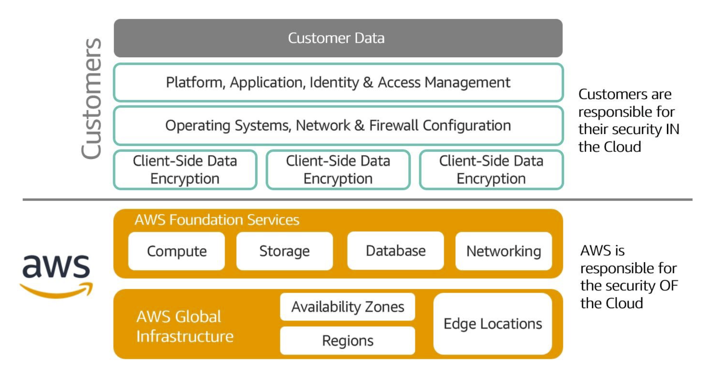

# Definition of cloud computing
Cloud computing is the on-demand delivery of IT resources over the internet with pay-as-you-go pricing

# Six benefits of cloud computing
1. trade upfront expenses for variable expenses
2. stop spending money to run and maintain data centers
3. stop guessing capacity
4. benefit from massive economies of scale
5. increase speed and agility
6. go global in minutes

# Deployment Models
1. infrastructure as a service (IaaS)
2. platform as a service (PaaS)
3. software as a service (SaaS)

# Deploying Strategies
1. cloud
2. hybrid
    - cloud based resources are connected to on-premise infrastructure
3. on-premise
    - known as private cloud deployment
    - resources are deployed on premises by using virtualization and resource management tools

# AWS Global Infrastructure
1. region
    - physical location around the world where data centers are clustered together
2. availability zone
    - a group of logical data centers is called an availability zone
3. edge location
    - cache copies of your content for faster delivery

## Benefits
1. performance
2. availability
3. security
4. reliability
5. scalability
6. low cost

# Plan for failure
1. storage
    - when a file is stored in Amazon S3, the file is redundantly copied into every Availability Zone in that Region
2. compute
    - best practice to spread out computing resources across multiple availability zone to guarantee high availability
3. database
    - configure database to for Multi-AZ deployment

# Shared Responsibility

  

1. aws responsibility
    - physical security of data centers
    - hardware and software infrastructure
    - network infrastructure
    - virtualization infrastructure

2. customer responsibility
    - content inside the cloud
    - access, permissions
    - operating system
    - client side data encryption
    - network, firewall configuration

# AWS Well-Architected Framework
1. operational excellence
    - ability to run and monitor systems to deliver business value and continually improve
    - operations as code
    - annotating documentation
    - anticipating failures
2. security
    - ability to protect information, systems, and assets while delivering business value through risk assessments and mitigation strategies
    - protect data in transit and at rest
3. reliability
    - ability of a system to recover from infrastructure or service disruption
    - dynamically acquire computing resources to meet demand
    - automatically recoverng from failures
4. performance efficiency
    - ability to use computing resources efficiently and maintain that efficiency as demand changes and technologies evolve
5. cost optimization 
    - ability to run systems to deliver business value at the lowest price point
    - reduce total cost of ownership

# AWS Well-Architected Tool
- review your answers against the five pillars established by the Well-Architected Framework

# AWS Pricing Calculator
- estimates the cost of AWS products and services
- provides summary report
- comprehensive detailed report
- FAQ that explains assumptions and methods used

# AWS Cloud9
- cloud-based integrated development environment (IDE) that lets you write, run, and debug your code with just a browser
- code together in real-time
- starts project quickly and code with only a web browser
- build serverless applications

# Amazon CodeWhisper
- AI powered code generator for IDEs and code editors
- security scanning (code)
- includes velocity
- spend less time writing code
- produce more secure code
- reduce risk of security vulnerabilities
- increase code quality and reliability