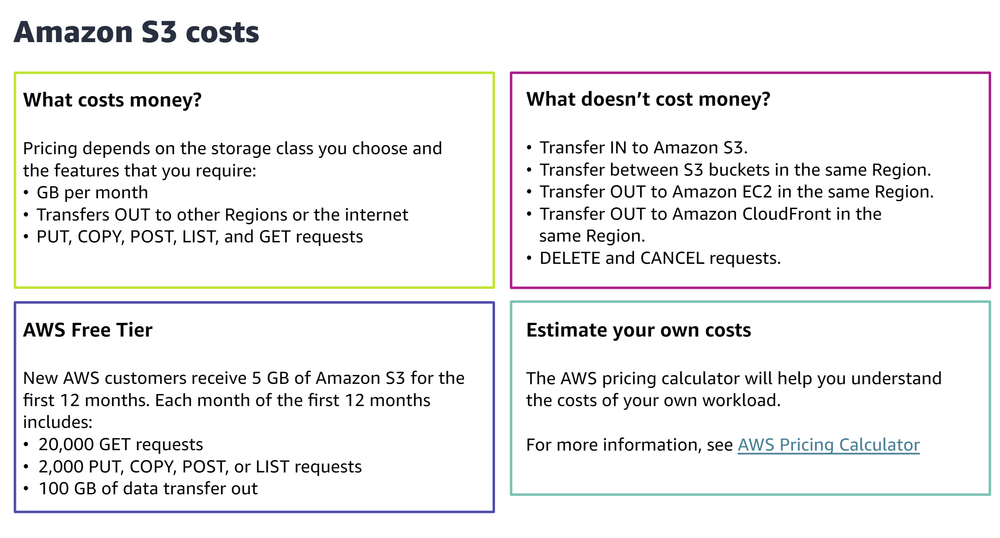
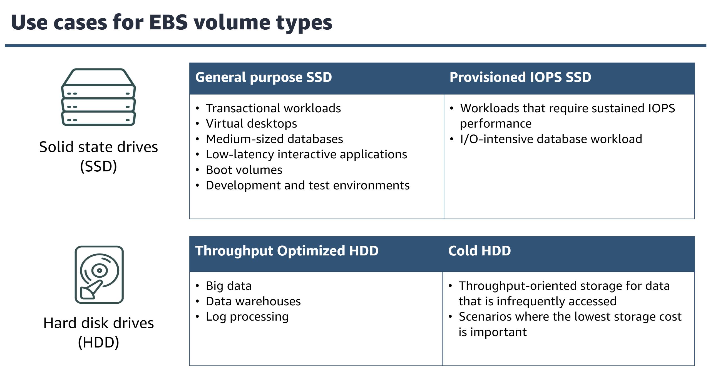

# Benefits of Cloud Storage
1. cost efficient
2. secure
3. accessible
4. scalable
5. managed
6. backed up

# Types of Cloud Storage
1. block storage
2. file storage
3. object storage

# Amazon S3 costs

  

# Amazon S3 lifecycle rules
1. transition rules
    - transition actions define when object transition from one storage class to another
2. expiration rules
    - expiration actions define when objects expire and are deleted

# AWS data migration service
1. s3 transfer acceleration
    - utilize aws cloudfront edge location to utilize aws network for faster
2. aws snowcone
    - HDD - 8TB
    - SSD - 14TB
3. aws snowball
    - 72TB
4. aws snowmobile
    - 100PB

# Block storage at AWS (both for ec2)
1. amazon ec2 instance store (disk storage) => temporary
2. amazon ebs (not temporary)

# EBS key features
1. data availability
    - automatically replicated across availability zone
2. data persistence
3. data encryption
4. data security
5. snapshots
6. flexibility

# EBS volume types
1. SSD - solid state drive (faster)
    - general purpose
    - provisioned IOPS
        - high performance for mission-critical, low-latency or high throughput workloads
2. HDD - hard disk drive
    - throughput optimized
    - cold hdd

  

# File storage

## Amazon EFS key features and benefits
1. fully managed
2. highly available and durable
    - by default, redundantly stores every file system object across multiple availability zones
3. elastic and scalable
    - grows and shrinks automatically
4. data encryption
