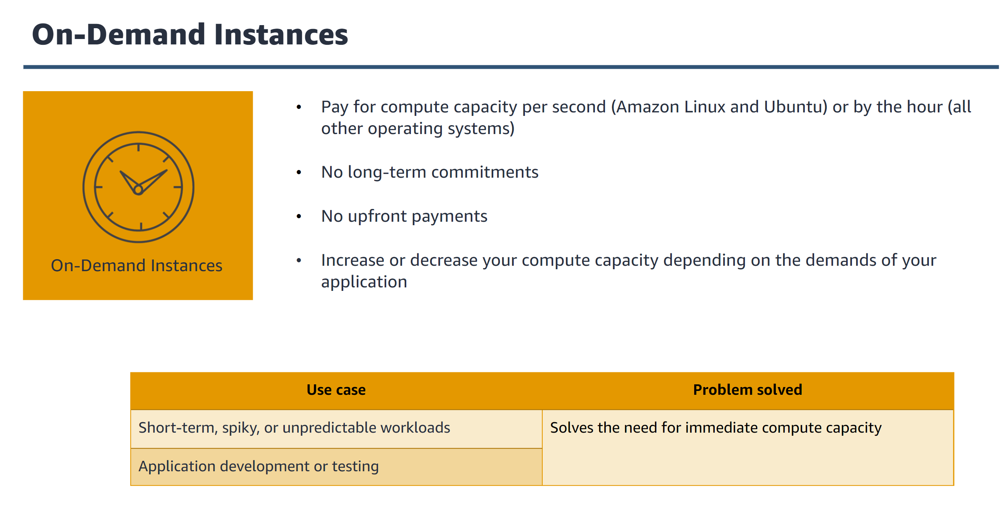

# Computing methods
1. instances
    - a virtual machine
    - hosting environment
    - development and tetsing environments
    - backup and disaster recovery
2. containers
    - method of os visualization that you can use to run an application and its dependencies in resource-isolated process
    - smaller than virtual machiens
    - shares a virtualized OS
    - building microservices architecture
    - video rendering services
    - quick development and deployment
3. serverless
    - ability to run code without provisioning or maning servers
    - file processing
    - web applications
    - mobile backends
    - cronjobs
4. hybrid
    - cloud based resources are connected to on premise infrastructure
    - legacy applications
    - company regulatory requirements
    - government regulatory requirements

# AWS computing services
1. amazon ec2
2. aws lambda
3. amazon ecs
4. amazon eks
5. aws fargate
6. aws elastic beanstalk
    - elastic beanstalk automatically handles the deployment for you

# Amazon EC2 (Amazon Elastic Compute Cloud Service)
- a web service that provides resizable compute capacity in the cloud at affordable cost at all around the world

# What problem does EC2 solve?
- when running servers on-premises
    - need to predict traffic spikes and peak workloads
    - need to consider the possibility of unused and idle servers
    - cost of unused resources
- when running servers on EC2
    - no need to guess capacity
    - launch servers when you need them
    - terminate or stop instances when you no longer need them
    - pay for only what you use

# EC2 benefits
1. elastic computing
    - can decrease or increase capacity within minutes
    - auto scaling group
2. complete control
3. flexible hosting service
4. integrated
5. reliable
6. secure
7. inexpensive
8. get started quickly

# EC2 architecture
1. region
2. vpc (example: development, testing, production)
3. subnet
4. security group

# Instance cost
1. instance purchasing options
    - on-demand instances

  

    - reserved instances

  

    - saving plans instances

  

    - spot instances

  

2. tenancy
- tenancy defines how ec2 instances are distributed across the physical host hardware
    - shared tenancy
    - dedicated tenancy
    - dedicated host

  

3. amazon machine image (AMI)
4. instance type
5. storage type and size

# Steps to launching an EC2 instances
1. instance name and tags
2. amazon machine image
3. instance type
    - main components: cpu, memory, network performance
    - instance family
    - t3.large => t is the family, 3 is the generation number, large is the size of the instance
    - instance categories:
        1. general purpose (a1, m4, m5, t2, t3)
        2. compute optimized (c4, c5) - benefit from high performance processors
        3. memory optimized (r4, r5, x1, z1) - designed for process large data sets
        4. accelerated computing (f4, g3, g4, p2, p3) - for floating numbers, graphics processing
        5. storage optimized (d2, h1, i3) - high sequential read write access to large data sets
4. key pair
5. network settings
6. configure storage
7. advanced details

  

# Amazon EC2 lifecycle states

  

# Amazon EC2 lifecycle state flows

  

