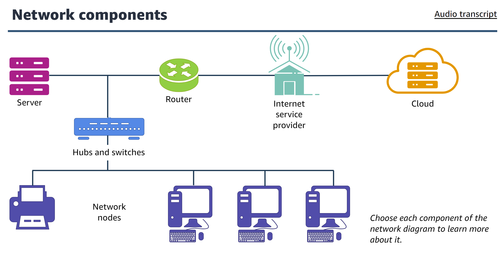
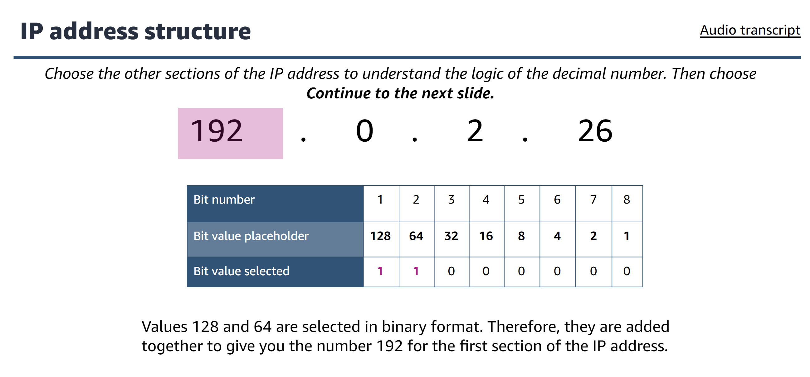
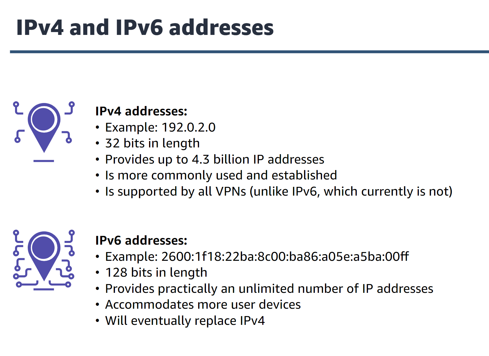
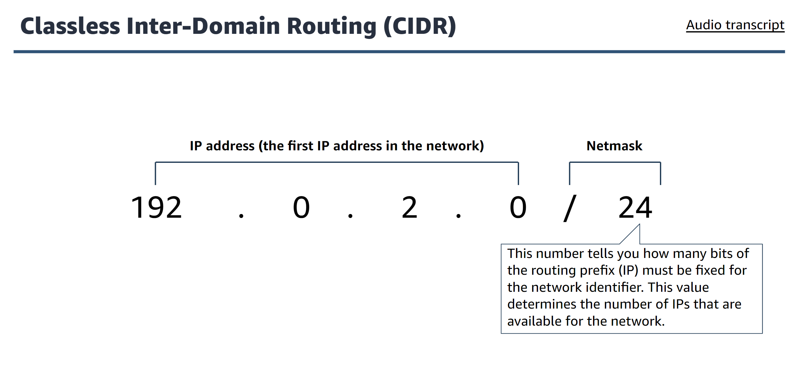
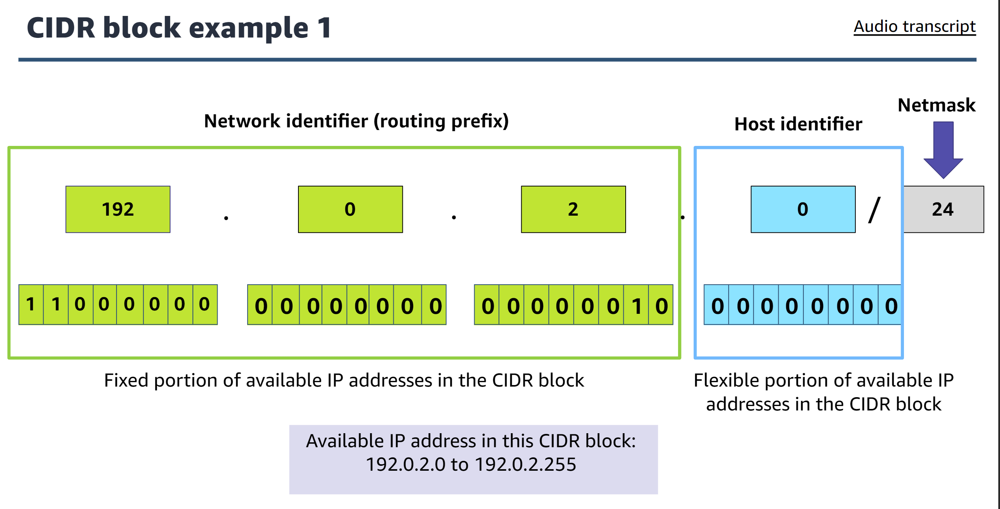
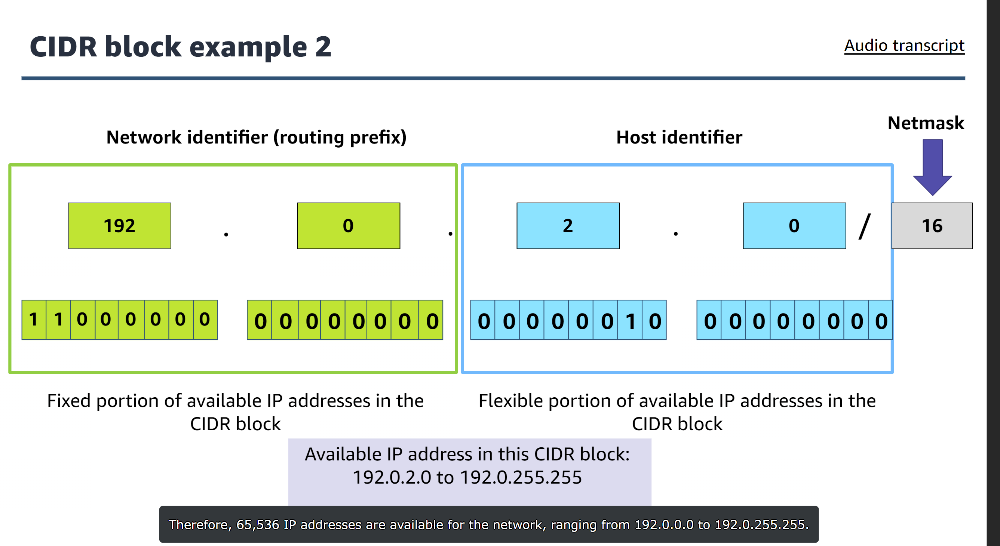
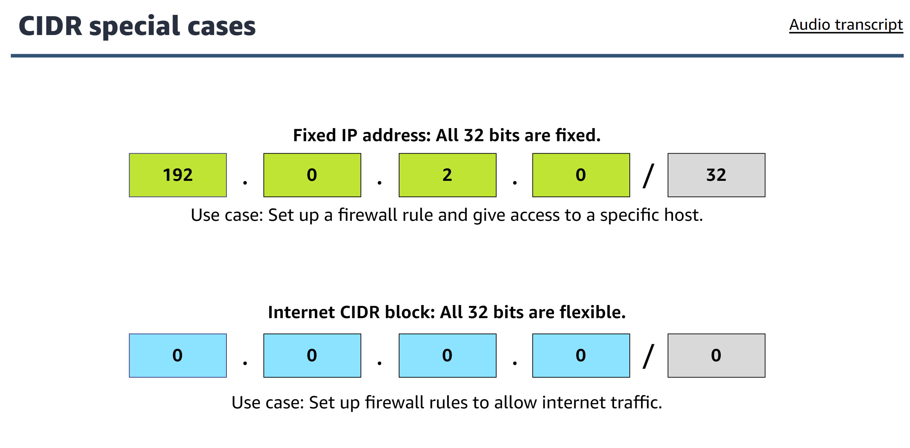
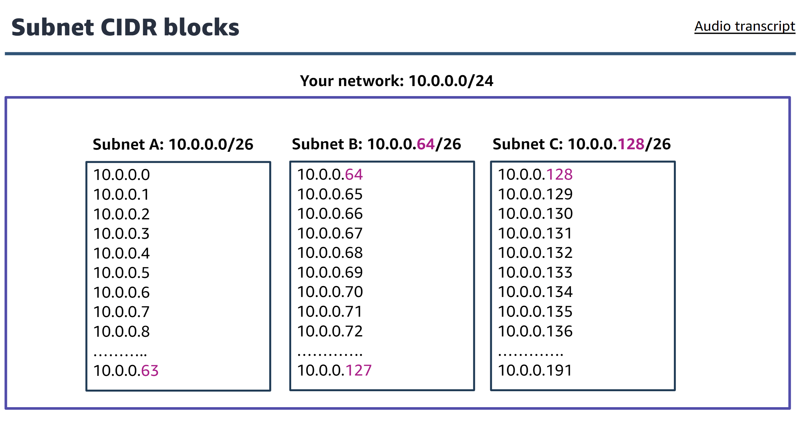

# What is networking?
- devices on the network are called nodes
- networks require network connecting devices (such as router and switch) to connect all devices together

# Network components

  

1. internet service provider
2. router
    - a network device that connects multiple network segments into one network. Connect multiple switches and their respective networks to enable communication between different network
3. hubs and switches
    - hub is the device to connects all the nodes of a network together. Any transmitted data that is received on one port is rebroadcast to all other ports on the hub
    - switch connects multiple nodes of a network together. A hub rebroadcasts any signal that is receives on one port to all others. A switch makes a direct link between the transmitting device and receiving device. Any device that is not intended target will not receive the transmission. Benfit of a switch over a hub is that the switch improves performance because it does not waste bandwidth on unnecessary transmissions
4. network nodes
5. server
6. cloud

# Open Systems Interconnection model (OSI)
1. physical layer (layer 1)
    - defines standards for transmiting raw data (bits) over transmission media to connect network nodes. Physical layers provides an electrical, mechanical, and procedure interface to the transmission medium
2. data link layer (layer 2)
    - defines standards for transferring data between adjacent network nodes in a wide area network (WAN) or between nodes on the same local area network (LAN)
    - provide the means to detect and possibly correct errors that might occur in physical layer
3. network layer (layer 3)
    - responsible for communication across different network
4. transport layer (layer 4)
    - provides transparent ransfer of data between users, and it provides a reliable data transfer service to the upper layers
5. session layer (layer 5)
    - provides mechanism for opening, closing, and managing a session between user application processes
6. presentation layer (layer 6)
    - responsible for formatting and delivering information to the application layer for further processing or display. Translates data based on syntax that the application accepts
7. application layer (layer 7)
    - closest to the user, identifying communication partners, determining resource availability, synchronizing communication

# Network Models
1. peer-to-peer model diagram
2. client-server model diagram

# Network Types
1. LAN (Local area Network)
    - connects devices in a limited geographical area such as floor, building or campus
    - ethernet
2. WAN (Wide area Network)
    - connects devices in a large geographical area, such as multiple cities or countries. WANs are used to connect LANs and use technologies such as fibre-optic cables and satelities to transmit data

# Internet Protocol Address structure (IP address)

  

- ipv4 has 4 8-bits splitted by a dot . (meaning that the largest is 256)

# IPv4 and IPv6

  

# Classles Inter-Domain Routing (CIDR)

  

# CIDR example 1

  

- ip address available = 2^8

# CIRD exmaple 2

  

- ip address available = 2^16

# CIRD special cases

  

# Subnet cidr block

  

